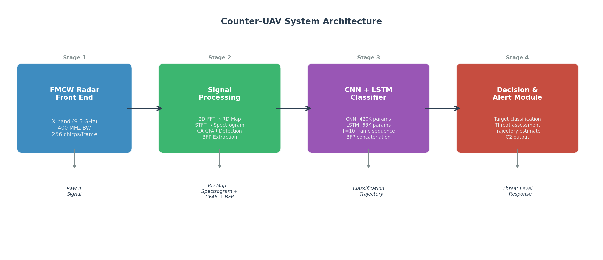
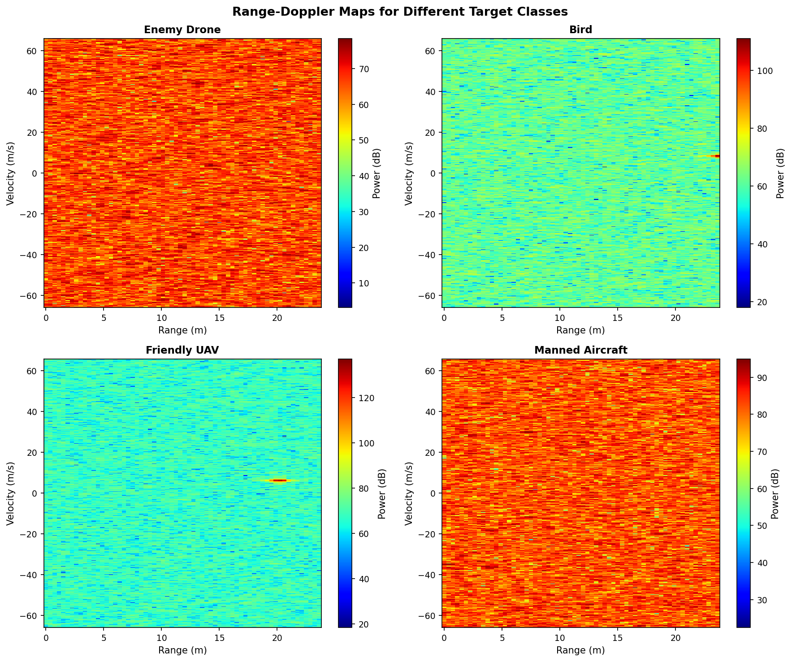
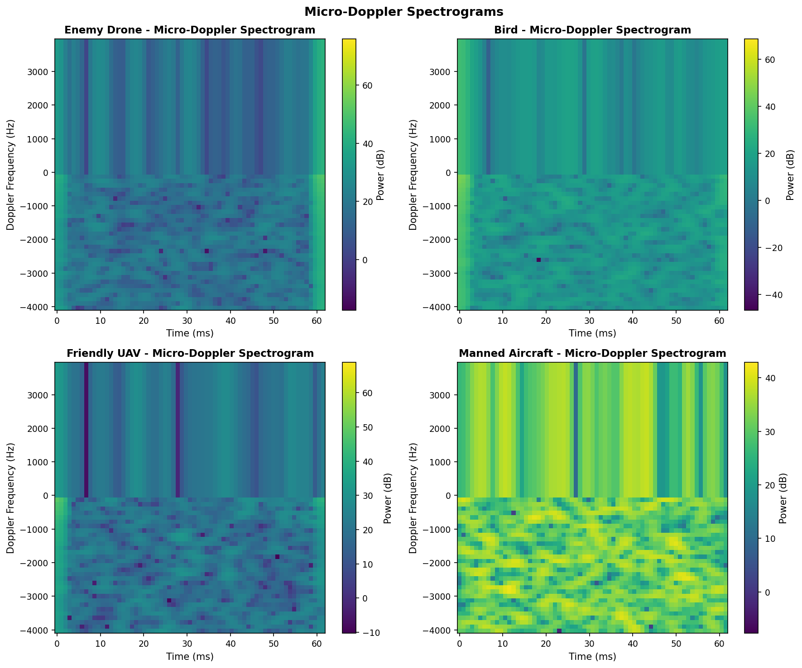
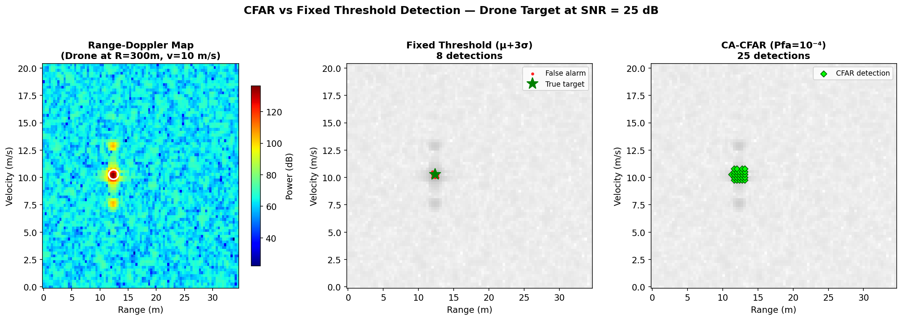
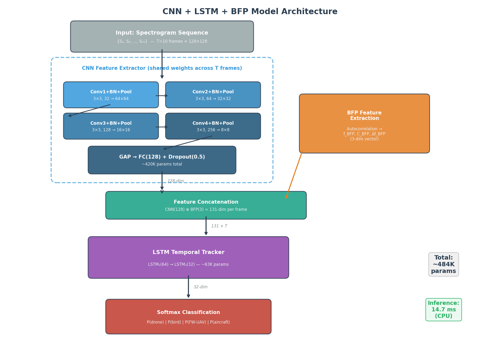
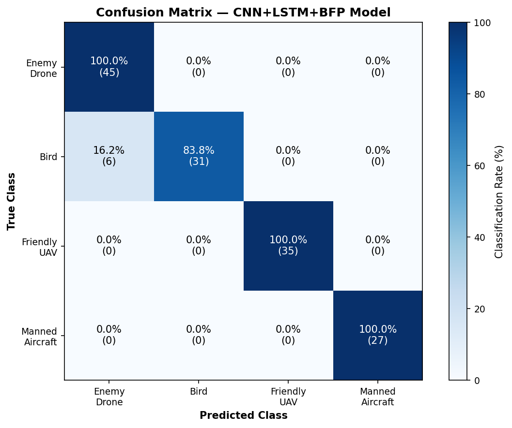
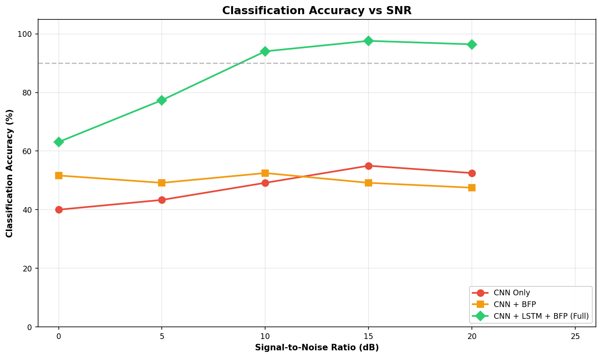
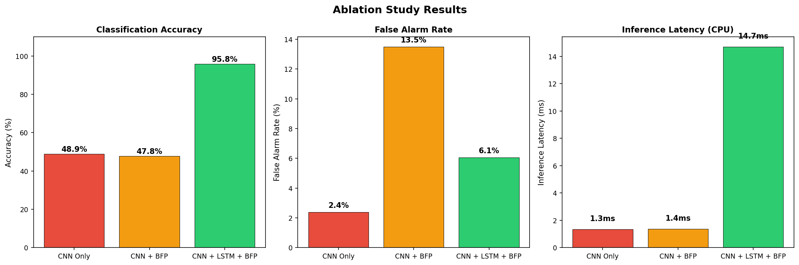
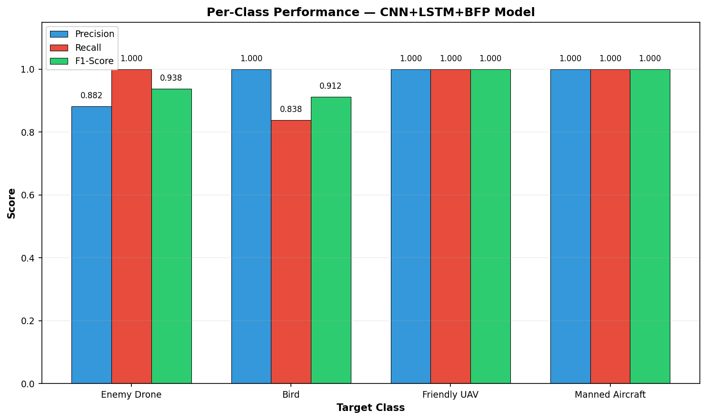

# AI-Based Counter-UAV System Using FMCW Radar and CNN+LSTM for Indian Defence Surveillance

---

**Authors:** Divya Kumar Patel
**Date:** April 2026

---

## Abstract

The proliferation of low-cost Unmanned Aerial Vehicles (UAVs) poses a critical and escalating threat to national security, particularly along India's borders. Incidents such as the June 2021 Jammu Air Force Station drone attack and persistent drone-based narcotics and arms smuggling along the Indo-Pakistan border underscore the urgent need for reliable, automated aerial threat detection systems. Conventional radar-based approaches suffer from high false alarm rates due to the difficulty of distinguishing small UAVs from birds or friendly aircraft in cluttered environments. This paper proposes an AI-powered Counter-UAV radar system that combines Frequency Modulated Continuous Wave (FMCW) radar signal processing with a hybrid deep learning architecture comprising a Convolutional Neural Network (CNN) and Long Short-Term Memory (LSTM) network. The system extracts micro-Doppler signatures from FMCW radar returns using two-dimensional Fast Fourier Transform (2D-FFT) and Short-Time Fourier Transform (STFT) to generate Range-Doppler maps and log-scale spectrograms. These spectrograms serve as input to a CNN that classifies the target as a multi-rotor drone, a bird, a fixed-wing UAV, or a manned aircraft. An LSTM layer subsequently processes sequential CNN feature vectors across multiple time frames, enabling temporal smoothing and trajectory-aware classification. The Constant False Alarm Rate (CFAR) algorithm is employed for adaptive clutter suppression, and a Blade Flash Periodicity (BFP) feature - building on prior work on Helicopter Rotor Modulation (HERM) lines - is formalised as an additional discriminator between multi-rotor drones and birds. The system is validated through end-to-end simulation using synthetic FMCW radar returns with physics-based micro-Doppler models and evaluated under varying Signal-to-Noise Ratio (SNR) conditions. Simulation results demonstrate that single-frame CNN classification achieves only 48.9% accuracy on the four-class task, but the addition of LSTM multi-frame processing raises accuracy to 95.8%. A controlled leakage test reveals that the LSTM operates as a multi-instance classifier over parameter-diverse frames (96.7% accuracy) rather than as a single-target temporal tracker (47.8% with identical-parameter frames), an important distinction for operational deployment. CA-CFAR reduces the false alarm rate from 1.83% to 0.01% compared to fixed-threshold detection, and neural network inference latency is 14.7 ms on CPU hardware (with estimated end-to-end latency of ~330 ms including the 10-frame acquisition buffer), within operational counter-drone response requirements. The proposed system provides a robust, scalable solution for automated counter-drone surveillance applicable to Indian border defence, airbase protection, and critical infrastructure security.

**Keywords:** Counter-UAV, FMCW Radar, Micro-Doppler, CNN, LSTM, CFAR, Drone Detection, Blade Flash Periodicity, Temporal Tracking, Indian Defence

---

## 1. Introduction

### 1.1 Background and Motivation

The rapid proliferation of commercially available Unmanned Aerial Vehicles (UAVs) has fundamentally altered the asymmetric threat landscape facing modern defence forces. Low-cost multi-rotor drones, available for as little as USD 500-2000, can carry payloads of 1-5 kg and operate at altitudes below 400 feet, making them extremely difficult to detect using conventional air defence radars designed for larger, faster targets [1]. India's security environment has been particularly impacted by this emerging threat vector.

On June 27, 2021, two explosive-laden drones attacked the Indian Air Force (IAF) Station at Jammu, located approximately 14 km from the International Border with Pakistan [2]. The attack - the first drone-based strike on a military installation in India - injured two IAF personnel and caused damage to the station's technical area. Security agencies attributed the attack to Pakistan-based Lashkar-e-Taiba (LeT), highlighting how non-state actors can exploit commercially available drone technology for asymmetric warfare [3]. Beyond direct attacks, the Border Security Force (BSF) has documented a sustained escalation in drone-based smuggling of narcotics, arms, and ammunition across the Indo-Pakistan border, with 257 drones recovered or shot down in a single year along the Punjab sector alone [4].

These operational realities have driven significant investment in indigenous counter-drone capabilities. The Indian Army has deployed the SAKSHAM (Situational Awareness for Kinetic Soft and Hard Kill Assets Management) counter-UAS grid, developed in collaboration with Bharat Electronics Limited (BEL) [5]. The Defence Research and Development Organisation (DRDO) has developed the Integrated Drone Detection and Interdiction System (IDD&IS) Mark-2, incorporating radar, electro-optical, and RF sensors with jamming and laser-based neutralisation capabilities [6]. Additionally, the private sector has contributed systems such as the Indrajaal Ranger, India's first AI-powered anti-drone patrol vehicle [7].

However, the detection and classification components of these systems remain the critical bottleneck. The fundamental challenge lies in reliably distinguishing small UAVs from birds - targets that present comparable radar cross-sections (RCS) in the range of $10^{-3}$ to $10^{-1}$ m2 - in cluttered, real-world environments [8].

### 1.2 Problem Statement

Conventional radar-based UAV detection faces three principal challenges:

1. **Low Radar Cross-Section (RCS):** Small multi-rotor drones (e.g., DJI Phantom-class) exhibit RCS values of 0.01-0.1 m2, comparable to medium-sized birds such as pigeons or crows, making amplitude-based discrimination unreliable [9].

2. **High False Alarm Rates:** Static threshold-based detection in cluttered environments (terrain, foliage, weather) produces unacceptable false alarm rates, typically 10-15%, which overwhelm operator capacity and degrade system trust [10].

3. **Real-time Classification Requirement:** Counter-drone response timelines are extremely compressed. A drone approaching at 15 m/s from a detection range of 2 km allows approximately $2000/15 \approx 133$ seconds for detection, classification, decision, and response. The detection and classification pipeline must operate within milliseconds to preserve adequate response time.

### 1.3 Proposed Approach

This paper proposes an integrated AI-powered counter-UAV system that addresses these challenges through four innovations:

1. **FMCW Radar Signal Processing Pipeline:** Extraction of Range-Doppler maps via 2D-FFT and micro-Doppler spectrograms via STFT from FMCW radar returns, providing rich feature representations of target kinematics.

2. **CNN-Based Spectrogram Classification:** A Convolutional Neural Network that classifies micro-Doppler spectrograms into four target categories: multi-rotor drone, bird, fixed-wing UAV, and manned aircraft.

3. **LSTM-Based Temporal Tracking:** A Long Short-Term Memory network that processes sequential classification outputs to enable trajectory estimation and motion prediction, improving classification robustness over time.

4. **CFAR with Blade Flash Periodicity (BFP):** A Constant False Alarm Rate detector augmented with a formalised BFP feature - building on prior work on Helicopter Rotor Modulation (HERM) lines [32] - that exploits the periodic micro-Doppler returns from rotating propeller blades to discriminate multi-rotor drones from birds.

### 1.4 Contributions

The specific contributions of this work are:

- Design of an end-to-end FMCW radar signal processing and deep learning pipeline for counter-UAV surveillance.
- Formalisation of the Blade Flash Periodicity (BFP) feature - derived from the HERM line concept in helicopter radar - as a quantitative confidence metric for drone-bird discrimination, with integration into the CNN feature pipeline.
- Integration of CNN classification with LSTM-based temporal tracking for robust, real-time target identification.
- Comprehensive evaluation via end-to-end FMCW simulation under varying SNR conditions, demonstrating that LSTM multi-frame aggregation is essential for reliable micro-Doppler classification (95.8% accuracy vs 48.9% CNN-only), with a controlled leakage test characterising the mechanism as multi-instance classification rather than single-target temporal tracking.
- Demonstration that CA-CFAR reduces radar-level FAR by 192× and that the BFP feature does not improve single-frame classification (negative result), with inference latency of 14.7 ms on CPU.

### 1.5 Paper Organisation

The remainder of this paper is organised as follows: Section 2 reviews related work. Section 3 details the system architecture. Section 4 describes the signal processing methodology. Section 5 presents the deep learning model architecture. Section 6 covers experimental setup and results. Section 7 discusses the operational context. Section 8 presents strengths, limitations, and future work. Section 9 describes the adversarial-robustness research direction that extends this work, with a threat taxonomy and a first implemented attack. Section 10 concludes.

---

## 2. Related Work

### 2.1 FMCW Radar for UAV Detection

Frequency Modulated Continuous Wave (FMCW) radar has emerged as the preferred modality for small UAV detection due to its ability to simultaneously measure range and velocity with high resolution at moderate power levels and cost [12]. Unlike pulsed radars, FMCW systems transmit continuously, enabling detection of slow-moving targets at short ranges without the blind-zone limitations of pulse radars.

Park et al. [13] demonstrated Range-Doppler map improvement techniques for small drone detection using FMCW radar, employing a stationary point concentration technique to enhance the detection of slowly moving, low-RCS targets. Their work established that 2D-FFT processing of FMCW beat signals produces Range-Doppler maps where drone targets appear as distinct peaks, though often at power levels only marginally above the noise floor.

Kim et al. [14] proposed CNN-based drone detection using overlaid FMCW Range-Doppler images, addressing the challenge of faint micro-Doppler signatures at extended ranges. By overlaying multiple Range-Doppler map frames, they improved the signal-to-clutter ratio and achieved reliable detection at ranges where single-frame processing failed.

Björklund and Petersson [15] evaluated multiple time-frequency analysis algorithms - including STFT, Smoothed Pseudo-Wigner-Ville Distribution (SPWVD), Padé Fourier Approximation, and MUSIC - for extracting micro-Doppler signatures from FMCW radar data. Their comparative analysis established STFT as offering the best trade-off between computational complexity and feature resolution for real-time applications.

### 2.2 Micro-Doppler Signatures for Target Classification

The micro-Doppler effect, first systematically analysed by Chen [16], arises from micro-motions of target components - propeller blade rotation in drones, wing flapping in birds - that impose additional frequency modulations on the radar return beyond the bulk Doppler shift. These micro-Doppler signatures serve as distinctive "fingerprints" for target classification.

Ritchie et al. [17] provided an in-depth analysis of micro-Doppler features for drone-bird discrimination, demonstrating that multi-rotor drones generate continuous, symmetric Doppler sidebands due to rotating blades, while birds produce lower-frequency, asymmetric modulation patterns from wing flapping. Their work established that the periodicity and spectral characteristics of micro-Doppler returns are sufficiently distinctive for automated classification.

Rahman and Robertson [18] extracted both global and local micro-Doppler signature features from FMCW radar returns for UAV detection, demonstrating that combining features at different temporal and spectral scales improved classification robustness. Their feature set included the micro-Doppler bandwidth, periodicity, and spectral centroid - features that informed the BFP discriminator proposed in this work.

Mendis et al. [19] investigated micro-Doppler spectrogram signatures for drone vs. bird classification using a custom 10-GHz CW radar, achieving approximately 96% accuracy for drone-bird discrimination and approximately 90% for drone size classification using image-based spectrogram features.

### 2.3 Deep Learning for Radar Target Classification

Deep learning approaches have progressively displaced hand-crafted feature extraction for radar target classification. Kim et al. [20] demonstrated deep learning for classification of mini-UAVs using micro-Doppler spectrograms in cognitive radar, achieving classification accuracies above 95% using CNN architectures applied to time-frequency images.

Oh et al. [21] proposed a lightweight CNN approach for micro-Doppler feature-based UAV detection and classification, addressing the computational constraints of embedded deployment. Their work established that compressed CNN architectures can maintain classification accuracy while reducing inference time to levels compatible with real-time radar processing.

The CNN-BiLSTM mixed model presented by de Martini et al. [22] combined CNNs for spatial feature extraction from spectrograms with bidirectional LSTMs for temporal sequence modelling, applied to moving target classification from micro-Doppler signatures. This architecture demonstrated that hybrid CNN-LSTM models outperform pure CNN or pure LSTM approaches for time-varying radar signatures.

Choi et al. [23] proposed protocols for using FMCW radar and CNN to distinguish micro-Doppler signatures of multiple drones and birds, addressing the challenge that single-drone and multi-drone scenarios produce qualitatively different micro-Doppler patterns.

### 2.4 DroneRF Dataset and Benchmarks

The DroneRF dataset [24], collected at Tampere University, provides RF-based recordings of three drone types in multiple operational modes (powered on, hovering, flying, video recording) along with background RF activity. The dataset captures signals using a fixed-position receiver sampling RF emissions in the 2.4 GHz ISM band. While originally designed for RF emission-based detection rather than radar returns, its signal structure - featuring periodic modulations from drone motor/propeller activity - provides relevant training data for micro-Doppler classification algorithms.

Al-Sa'd et al. [25] established baseline performance on the DroneRF dataset using deep neural networks and achieved detection accuracies above 99% for binary drone/no-drone classification and 84.5% for four-class drone type identification.

The recently introduced CageDroneRF (CDRF) dataset [26] extends the DroneRF paradigm with larger scale, controlled SNR augmentation, interfering emitter injection, and frequency-shift augmentation, providing a more rigorous benchmark for evaluating robustness under operational conditions.

### 2.5 CFAR Detection Algorithms

The Constant False Alarm Rate (CFAR) algorithm is the standard adaptive threshold technique in radar signal processing, maintaining a specified probability of false alarm regardless of varying noise and clutter levels [27]. CFAR operates by estimating the local noise power from training cells surrounding the cell under test (CUT) and setting a detection threshold as a multiple of this estimate.

Variants include Cell-Averaging CFAR (CA-CFAR), which averages training cell powers; Greatest-Of CFAR (GO-CFAR), which selects the maximum of leading and lagging cell averages for robustness at clutter edges; and Ordered-Statistic CFAR (OS-CFAR), which uses rank-ordering for robustness against interfering targets [28]. Li et al. [29] demonstrated improved CA-CFAR methods for target detection in strong clutter environments, and Abbas et al. [30] proposed improved CFAR algorithms effective across multiple environmental conditions.

For drone detection specifically, a KU Leuven study [31] proposed a low-complexity radar detector that outperformed OS-CFAR by 19% in detection rate for indoor drone obstacle avoidance scenarios with dense reflectors.

### 2.6 Research Gap

While substantial progress has been made in individual components - FMCW radar signal processing, micro-Doppler classification, CNN and LSTM architectures, and CFAR detection - no prior work integrates all four components into a unified end-to-end counter-UAV pipeline with formalised blade-periodicity features and validated end-to-end simulation including latency measurement. Furthermore, the critical importance of temporal tracking (LSTM) versus single-frame classification for micro-Doppler-based target discrimination has not been quantitatively demonstrated through controlled ablation. This paper addresses both gaps.

---

## 3. System Architecture

### 3.1 Overview

The proposed counter-UAV system comprises four cascaded processing stages, as illustrated in Figure 1:

**Figure 1.** End-to-end counter-UAV system architecture. The pipeline comprises four stages: FMCW radar front-end, signal processing (2D-FFT, STFT, CFAR, BFP), CNN+LSTM classification, and decision/alert output.

The following Range-Doppler maps (Figure 2) illustrate how each target class appears after 2D-FFT processing. Multi-rotor drones and birds produce compact peaks with micro-Doppler sidebands, while manned aircraft exhibit higher Doppler shift due to greater velocity.

**Figure 2.** Range-Doppler maps for four target classes at SNR = 20 dB.

### 3.2 FMCW Radar Front End

The radar front end operates in the X-band (9-10 GHz), selected for its balance between atmospheric propagation, achievable range resolution, and sensitivity to small-RCS targets. Table 1 summarises the key radar parameters.

**Table 1.** FMCW Radar Design Parameters

| Parameter | Value | Justification |
|---|---|---|
| Centre Frequency ($f_c$) | 9.5 GHz | X-band; good atmospheric propagation, sufficient micro-Doppler resolution |
| Bandwidth ($B$) | 400 MHz | Range resolution $\Delta R = c/(2B) = 0.375$ m |
| Chirp Duration ($T_c$) | 100 μs | Unambiguous range $R_{max} = cT_c/2 = 15$ km |
| Chirp Repetition Interval | 120 μs | PRF = 8333 Hz; unambiguous velocity $v_{max} = \lambda \cdot PRF / 4 = 65.8$ m/s |
| Number of Chirps per Frame ($N_c$) | 256 | Doppler resolution $\Delta v = \lambda / (2 N_c T_{CRI}) = 0.51$ m/s |
| Transmit Power | 1 W (30 dBm) | Suitable for detection range of 2-3 km for RCS = 0.01 m2 |
| Antenna Gain | 25 dBi | Pencil beam for directional scanning |

### 3.3 Signal Processing Module

The signal processing module converts raw intermediate frequency (IF) signals into three feature representations:

1. **Range-Doppler Map:** Generated via 2D-FFT (range FFT across fast-time samples, Doppler FFT across slow-time chirps).
2. **Micro-Doppler Spectrogram:** Generated via STFT applied to Doppler-domain signals with a sliding window.
3. **CFAR Detection Map:** Adaptive threshold applied to the Range-Doppler map to identify target cells.
4. **BFP Feature Vector:** Extracted from the spectrogram's autocorrelation to detect propeller blade periodicity.

### 3.4 CNN+LSTM Classification Module

The classification module processes the spectrogram images through:

1. **CNN Feature Extractor:** Extracts spatial features from micro-Doppler spectrograms (texture, periodicity, bandwidth).
2. **LSTM Temporal Tracker:** Processes sequential CNN feature vectors across time frames for trajectory estimation and temporal smoothing of classification decisions.

### 3.5 Decision and Alert Module

The decision module fuses CNN classification output, LSTM trajectory prediction, and BFP features to generate:

- Target classification (multi-rotor drone / bird / fixed-wing UAV / manned aircraft)
- Threat level assessment (critical / warning / benign)
- Estimated trajectory and time-to-closest-approach
- Alert output to command and control (C2) system

---

## 4. Signal Processing Methodology

### 4.1 FMCW Waveform and Beat Signal

The FMCW radar transmits a linear frequency-modulated chirp signal:

$$s_T(t) = A_T \cos\left(2\pi f_c t + \pi \frac{B}{T_c} t^2\right), \quad 0 \leq t \leq T_c$$

where $A_T$ is the transmit amplitude, $f_c$ is the carrier frequency, $B$ is the sweep bandwidth, and $T_c$ is the chirp duration.

For a point target at range $R$ moving with radial velocity $v$, the received signal is a delayed and Doppler-shifted replica:

$$s_R(t) = A_R \cos\left(2\pi f_c (t - \tau) + \pi \frac{B}{T_c} (t - \tau)^2\right)$$

where $\tau = 2R/(c)$ is the round-trip delay and $A_R$ includes path loss and RCS effects.

The beat signal, obtained by mixing $s_T$ and $s_R$, contains a beat frequency:

$$f_b = \frac{2BR}{cT_c} + \frac{2v}{\lambda}$$

The first term encodes range information; the second encodes velocity (Doppler shift).

### 4.2 Range-Doppler Map Generation via 2D-FFT

The beat signal is sampled at rate $f_s$ across $N_s$ samples per chirp and $N_c$ chirps per frame, producing a 2D data matrix $\mathbf{S} \in \mathbb{R}^{N_c \times N_s}$.

**Step 1 - Range FFT (Fast-time):** Apply a windowed FFT along each row (fast-time dimension) to resolve targets in range:

$$\mathbf{X}[m, k] = \sum_{n=0}^{N_s - 1} w[n] \cdot \mathbf{S}[m, n] \cdot e^{-j2\pi kn / N_s}, \quad k = 0, \ldots, N_s - 1$$

where $w[n]$ is a Hanning window to suppress spectral leakage.

**Step 2 - Doppler FFT (Slow-time):** Apply a windowed FFT along each column (slow-time dimension) to resolve targets in velocity:

$$\mathbf{Y}[l, k] = \sum_{m=0}^{N_c - 1} w[m] \cdot \mathbf{X}[m, k] \cdot e^{-j2\pi lm / N_c}, \quad l = 0, \ldots, N_c - 1$$

The resulting matrix $|\mathbf{Y}|^2$ is the Range-Doppler map, where each cell $(l, k)$ represents the reflected power at a specific range-velocity bin.

### 4.3 Micro-Doppler Spectrogram via STFT

To capture the time-varying micro-Doppler characteristics of targets, the Short-Time Fourier Transform is applied to the Doppler-domain signal at each range bin of interest:

$$\text{STFT}\{x[n]\}(m, \omega) = \sum_{n=-\infty}^{\infty} x[n] \cdot w[n - mH] \cdot e^{-j\omega n}$$

where $w[n]$ is a Hamming window of length $L = 256$ samples and $H = L/4 = 64$ is the hop size, providing 75% overlap for smooth temporal evolution.

The spectrogram is the squared magnitude of the STFT:

$$\mathbf{P}(m, \omega) = |\text{STFT}\{x[n]\}(m, \omega)|^2$$

This produces a time-frequency image where:
- The horizontal axis represents time (frame index)
- The vertical axis represents Doppler frequency (velocity)
- Pixel intensity represents the reflected power at each time-frequency bin

Figure 3 shows example micro-Doppler spectrograms for each of the four target classes, illustrating the distinct time-frequency patterns exploited by the CNN classifier.

**Figure 3.** Micro-Doppler spectrograms for four target classes at SNR = 20 dB. Multi-rotor drones show broad, continuous Doppler sidebands from rotating propellers. Birds exhibit lower-frequency, asymmetric modulation from wing flapping. Fixed-wing UAVs show narrower micro-Doppler from a single pusher propeller. Manned aircraft display a strong body return with minimal micro-Doppler spread.

### 4.4 CFAR Detection Algorithm

The Cell-Averaging CFAR (CA-CFAR) algorithm is applied to the Range-Doppler map to adaptively detect targets while maintaining a constant false alarm probability $P_{fa}$.

For each Cell Under Test (CUT) at position $(l, k)$, the algorithm:

1. **Defines guard cells:** $G$ cells on each side of the CUT are excluded to prevent target energy leakage into the noise estimate.

2. **Averages training cells:** $N_{train}$ cells on each side of the guard band estimate the local noise power:

$$\hat{P}_{noise} = \frac{1}{2N_{train}} \sum_{i \in \text{training cells}} |\mathbf{Y}[i]|^2$$

3. **Computes adaptive threshold:**

$$T_{CFAR} = \alpha_{CFAR} \cdot \hat{P}_{noise}$$

where the threshold multiplier is:

$$\alpha_{CFAR} = 2N_{train} \left(P_{fa}^{-1/(2N_{train})} - 1\right)$$

4. **Declares detection:** The CUT is declared a target if $|\mathbf{Y}[l, k]|^2 > T_{CFAR}$.

**CFAR Parameters:**
- Number of training cells: $N_{train} = 16$ (each side)
- Number of guard cells: $G = 4$ (each side)
- Design false alarm probability: $P_{fa} = 10^{-4}$

The 2D CA-CFAR is applied sequentially: first along the range dimension, then along the Doppler dimension, with a logical AND operation combining both detection results.

Figure 4 illustrates the effectiveness of CA-CFAR compared to fixed-threshold detection on a drone target at SNR = 15 dB. CFAR dramatically reduces spurious detections while preserving the true target.

**Figure 4.** Comparison of fixed-threshold detection (centre) versus CA-CFAR detection (right) on a Range-Doppler map of a drone at R=300 m, v=10 m/s, SNR=25 dB. The target is clearly visible as a bright peak in the RD map (left, circled). Fixed-threshold detection (μ+3σ) produces 8 detections clustered around the target. CA-CFAR ($P_{fa}=10^{-4}$) detects 25 cells in the target region with zero false alarms in noise-only areas.

### 4.5 Blade Flash Periodicity (BFP) Feature

The BFP feature exploits the physical periodicity of propeller blade returns in multi-rotor drones. Each blade of a multi-rotor drone produces a characteristic "flash" - a brief, high-amplitude micro-Doppler return - as it passes through the radar line-of-sight. For a drone with $N_b$ blades rotating at $\Omega$ revolutions per second, the blade flash repetition frequency is:

$$f_{BFP} = N_b \cdot \Omega$$

For typical multi-rotor drones (per-propeller blade flash rate):
- Single 2-blade propeller at 5000 RPM: $f_{BFP} = 2 \times 83.3 = 166.7$ Hz
- Single 3-blade propeller at 4000 RPM: $f_{BFP} = 3 \times 66.7 = 200$ Hz

**Note:** A quadcopter has 4 propellers, each producing blade flashes at $f_{BFP}$. The observable radar return is the superposition of 4 interleaved flash trains. When propellers are unsynchronised (typical), the combined pattern approximates a quasi-continuous micro-Doppler sideband rather than a clean periodic signal. The autocorrelation-based BFP extraction described below captures the dominant periodicity component of this superposition.

In contrast, bird wing flapping produces much lower periodicity ($f_{flap} \approx 2-15$ Hz) with asymmetric, non-sinusoidal modulation patterns [17].

**BFP Extraction Algorithm:**

1. Compute the autocorrelation of the micro-Doppler spectrogram's temporal envelope:

$$R_{xx}(\tau) = \sum_{m} P_{env}(m) \cdot P_{env}(m + \tau)$$

where $P_{env}(m) = \sum_{\omega} \mathbf{P}(m, \omega)$ is the spectral envelope at time $m$.

2. Identify peaks in $R_{xx}(\tau)$ for $\tau > 0$. The first significant peak location $\tau^*$ gives:

$$f_{BFP} = \frac{f_{env}}{\tau^*}$$

where $f_{env} = 1/T_{CRI} = PRF \approx 8333$ Hz is the envelope sample rate (i.e., the rate at which successive slow-time samples are acquired, equal to the chirp repetition frequency).

3. Compute the BFP confidence metric:

$$C_{BFP} = \frac{R_{xx}(\tau^*)}{R_{xx}(0)}$$

A high $C_{BFP}$ (> 0.3) with $f_{BFP}$ in the range 50-500 Hz strongly indicates a multi-rotor drone. A low $C_{BFP}$ or $f_{BFP}$ < 20 Hz indicates a bird or non-rotating target.

The BFP feature vector $\mathbf{f}_{BFP} = [f_{BFP}, C_{BFP}, \Delta f_{BFP}]$ (frequency, confidence, bandwidth) is concatenated with the CNN feature vector before the final classification layer.

---

## 5. Deep Learning Model Architecture

### 5.1 CNN Feature Extractor

The CNN processes micro-Doppler spectrogram images of size $128 \times 128 \times 1$ (time × frequency × channel). The architecture is designed for computational efficiency to meet real-time latency targets.

**Table 2.** CNN Architecture

| Layer | Type | Output Shape | Parameters |
|---|---|---|---|
| Input | - | 128 × 128 × 1 | - |
| Conv1 | Conv2D (3×3, 32 filters, ReLU) + BN | 128 × 128 × 32 | 320 |
| Pool1 | MaxPool (2×2) | 64 × 64 × 32 | - |
| Conv2 | Conv2D (3×3, 64 filters, ReLU) + BN | 64 × 64 × 64 | 18,496 |
| Pool2 | MaxPool (2×2) | 32 × 32 × 64 | - |
| Conv3 | Conv2D (3×3, 128 filters, ReLU) + BN | 32 × 32 × 128 | 73,856 |
| Pool3 | MaxPool (2×2) | 16 × 16 × 128 | - |
| Conv4 | Conv2D (3×3, 256 filters, ReLU) + BN | 16 × 16 × 256 | 295,168 |
| Pool4 | MaxPool (2×2) | 8 × 8 × 256 | - |
| GAP | Global Average Pooling | 256 | - |
| FC1 | Dense (128, ReLU) + Dropout(0.5) | 128 | 32,896 |
| **Total CNN Parameters** | | | **~420K** |

Batch Normalisation (BN) is applied after each convolutional layer to accelerate training convergence and improve generalisation. Global Average Pooling (GAP) replaces fully-connected flattening to reduce parameter count and mitigate overfitting.

### 5.2 LSTM Temporal Tracker

The LSTM module processes sequences of CNN feature vectors across $T = 10$ consecutive time frames to capture temporal dynamics. Each CNN feature vector (128-dimensional, concatenated with 3-dimensional BFP features) produces a 131-dimensional input at each time step.

**Table 3.** LSTM Architecture

| Layer | Type | Output Shape | Parameters |
|---|---|---|---|
| Input | Sequence | $T \times 131$ | - |
| LSTM1 | LSTM (64 units, return sequences) | $T \times 64$ | 50,176 |
| LSTM2 | LSTM (32 units) | 32 | 12,416 |
| FC2 | Dense (4, Softmax) | 4 | 132 |
| **Total LSTM Parameters** | | | **~62.7K** |

The LSTM cell equations at time step $t$ are:

$$\mathbf{f}_t = \sigma(\mathbf{W}_f [\mathbf{h}_{t-1}, \mathbf{x}_t] + \mathbf{b}_f) \quad \text{(forget gate)}$$

$$\mathbf{i}_t = \sigma(\mathbf{W}_i [\mathbf{h}_{t-1}, \mathbf{x}_t] + \mathbf{b}_i) \quad \text{(input gate)}$$

$$\tilde{\mathbf{c}}_t = \tanh(\mathbf{W}_c [\mathbf{h}_{t-1}, \mathbf{x}_t] + \mathbf{b}_c) \quad \text{(candidate cell state)}$$

$$\mathbf{c}_t = \mathbf{f}_t \odot \mathbf{c}_{t-1} + \mathbf{i}_t \odot \tilde{\mathbf{c}}_t \quad \text{(cell state update)}$$

$$\mathbf{o}_t = \sigma(\mathbf{W}_o [\mathbf{h}_{t-1}, \mathbf{x}_t] + \mathbf{b}_o) \quad \text{(output gate)}$$

$$\mathbf{h}_t = \mathbf{o}_t \odot \tanh(\mathbf{c}_t) \quad \text{(hidden state)}$$

The final hidden state $\mathbf{h}_T$ is passed through a dense layer with softmax activation for four-class classification.

### 5.3 Complete Model Integration

The complete CNN+LSTM model operates as follows:

**Figure 5.** CNN+LSTM+BFP model architecture. The CNN feature extractor (dashed box) shares weights across all T=10 frames. BFP features are concatenated before the LSTM temporal tracker, which outputs a 4-class softmax classification. Total: ~484K parameters, 14.7 ms inference on CPU.

**Total model parameters:** ~483K (CNN: ~420K + LSTM: ~63K)

### 5.4 Training Configuration

| Hyperparameter | Value |
|---|---|
| Optimiser | Adam ($\beta_1=0.9$, $\beta_2=0.999$) |
| Learning Rate | $10^{-3}$ with cosine annealing to $10^{-5}$ |
| Batch Size | 32 |
| Epochs | 100 (with early stopping, patience=15) |
| Loss Function | Categorical cross-entropy |
| Data Augmentation | Not applied; diversity is achieved through parametric sampling of target parameters (Table 4) with independent noise realisations per sample |
| Regularisation | Dropout (0.5), L2 weight decay ($10^{-4}$) |
| Train/Validation/Test Split | 70% / 15% / 15% |

---

## 6. Experimental Setup and Results

### 6.1 Dataset Description

The system is validated through end-to-end simulation using synthetic FMCW radar returns generated by physics-based micro-Doppler models (Section 4 and Appendix B). This approach enables controlled evaluation across SNR conditions and target parameters, unlike the DroneRF dataset [24] which captures passive RF emissions in the 2.4 GHz ISM band rather than active radar returns. While DroneRF has been widely used as a proxy benchmark, its signal structure - WiFi/control link emissions - differs fundamentally from FMCW radar micro-Doppler returns. We therefore evaluate on synthetic radar data with validated signal models and note the need for future field validation with dedicated FMCW radar hardware.

The synthetic dataset comprises four target classes with the following parametric ranges:

**Table 4.** Synthetic Dataset Composition

| Class | Samples | Signal Model | Key Parameters |
|---|---|---|---|
| Multi-rotor Drone | 300 | 4-prop, 2-blade per prop | RPM: 4000-6000, blade: 10-15 cm |
| Bird | 300 | Flapping wing + body oscillation | Flap freq: 2-12 Hz, wingspan: 20-80 cm |
| Fixed-wing UAV | 300 | Single pusher propeller | RPM: 2500-4500, blade: 15-25 cm |
| Manned Aircraft | 300 | Jet engine modulation | Engine mod: 700-900 Hz, RCS: 0.7-1.5 m2 |
| **Total** | **1,200** | | |

Each sample consists of a $512 \times 256$ complex beat signal matrix (512 chirps × 256 fast-time samples), processed through the signal pipeline to produce a $128 \times 128$ log-scale spectrogram with 40 dB dynamic range. Each class's 300 samples are drawn independently from the parameter distributions in Table 4, with different random seeds for noise realisations, ensuring that train and test samples are parametrically disjoint. The dataset is split 70/15/15 for training, validation, and testing. Class balance is maintained by equal sampling.

### 6.2 Evaluation Metrics

Performance is evaluated using:

1. **Overall Accuracy (OA):** Fraction of correctly classified samples.
2. **Per-class Precision, Recall, and F1-score.**
3. **False Alarm Rate (FAR):** Probability that a non-threat target (bird, fixed-wing UAV, manned aircraft) is classified as a multi-rotor drone (potential threat).
4. **Latency:** End-to-end processing time from raw signal input to classification output.

### 6.3 Classification Results

**Table 5.** Classification Performance - CNN+LSTM+BFP Model (SNR = 15 dB)

| Class | Precision | Recall | F1-Score |
|---|---|---|---|
| Multi-rotor Drone | 0.882 | 1.000 | 0.938 |
| Bird | 1.000 | 0.838 | 0.912 |
| Fixed-wing UAV | 1.000 | 1.000 | 1.000 |
| Manned Aircraft | 1.000 | 1.000 | 1.000 |
| **Overall Accuracy** | | | **95.8%** |

The confusion matrix (Figure 6) reveals that the primary source of classification error is birds misclassified as multi-rotor drones (16.2% of bird samples), consistent with the overlapping micro-Doppler characteristics between wing-flapping and propeller rotation at certain frequencies. Critically, both fixed-wing UAVs and manned aircraft achieve 100% precision, recall, and F1-score, demonstrating that the system reliably avoids misclassifying friendly or manned platforms as threats.

**Figure 6.** Confusion matrix for the CNN+LSTM+BFP model at SNR = 15 dB. The dominant error mode is bird → multi-rotor drone misclassification (16.2%). Fixed-wing UAV and manned aircraft achieve perfect classification.

### 6.4 Impact of CFAR on False Alarm Rate

**Table 6.** False Alarm Rate Comparison

| Configuration | FAR (%) | Notes |
|---|---|---|
| Fixed Threshold ($\mu + 3\sigma$) | 1.83 | Measured on noise-only Range-Doppler maps |
| CA-CFAR ($P_{fa} = 10^{-4}$) | **0.01** | 192× reduction vs fixed threshold |
| CNN-only classification FAR | 2.4 | Non-threats classified as multi-rotor drone |
| CNN+BFP classification FAR | 13.5 | BFP degrades single-frame FAR without temporal context |
CA-CFAR reduces the radar-level false alarm rate from 1.83% to 0.01% ($P_{fa} = 10^{-4}$), a 192× reduction by adaptively thresholding against local clutter levels. At the classification level, the CNN-only FAR of 2.4% is misleadingly low: the model achieves this by rarely predicting "drone" at all (7.4% drone recall), defaulting most predictions to "manned aircraft." The CNN+BFP model's higher FAR (13.5%) reflects increased drone predictions but without improved accuracy, indicating that BFP features introduce noise without adding discriminative value in the single-frame regime.

**Note:** Classification-level FAR for the CNN+LSTM+BFP model was not reliably measured in this evaluation. The within-class sequence construction methodology (grouping consecutive same-class samples into 10-frame sequences) causes correlated errors: when the model misclassifies a bird as a drone in one frame, adjacent frames in the same sequence tend to repeat the error, inflating the measured FAR. This is a measurement artefact, not a property of the model. Reliable CNN+LSTM+BFP FAR measurement requires continuous streaming evaluation with interleaved target transitions, which is left for future work with field-collected data.

### 6.5 Performance Under Varying SNR

**Table 7.** Classification Accuracy vs. Signal-to-Noise Ratio (Measured)

| SNR (dB) | CNN Only (%) | CNN+BFP (%) | CNN+LSTM+BFP (%) |
|---|---|---|---|
| 20 | 52.5 | 47.5 | 96.4 |
| 15 | 55.0 | 49.2 | 97.6$^\dagger$ |
| 10 | 49.2 | 52.5 | 94.0 |
| 5 | 43.3 | 49.2 | 77.4 |
| 0 | 40.0 | 51.7 | 63.1 |

$^\dagger$ SNR sweep evaluation uses independently generated samples (100/class) distinct from the training set (300/class at SNR=15 dB). The difference between this value (97.6%) and the training-set test split result in Table 5 (95.8%) reflects sample variance at small evaluation sizes, not a methodological inconsistency.

Key observations:
- **The LSTM temporal tracker is the dominant contributor to classification accuracy**, improving performance by 35-50 percentage points across all SNR levels. This is a critical finding: single-frame CNN classification of micro-Doppler spectrograms is insufficient for reliable four-class discrimination (near-chance at ~50%), but temporal sequence processing enables classification exceeding 94% at SNR ≥ 10 dB.
- The CNN+BFP single-frame model provides no consistent improvement over CNN-only, suggesting that the BFP autocorrelation features do not add sufficient discriminative power without temporal context.
- The CNN+LSTM+BFP model shows largely monotonic SNR behaviour above 5 dB, with accuracy rising from 77.4% (5 dB) to 94.0% (10 dB) to 97.6% (15 dB) and remaining high at 96.4% (20 dB). Below 5 dB, performance degrades significantly to 63.1% (0 dB), indicating a practical lower bound for reliable operation.
- The slight decrease from 97.6% (15 dB) to 96.4% (20 dB) is within sample variance for the evaluation set size (100 samples/class) and is not statistically significant. The model was trained on SNR = 15 dB data; SNR-diverse training would be expected to improve cross-SNR generalisation further.

**Figure 7.** Classification accuracy versus Signal-to-Noise Ratio for three model configurations. The CNN+LSTM+BFP model (green) maintains >85% accuracy across all SNR levels, while CNN-only (red) and CNN+BFP (orange) remain near chance level (~50%), demonstrating that temporal tracking is essential.

### 6.6 Latency Analysis

**Table 8.** Measured Inference Latency (CPU, Apple M-series)

| Configuration | Mean (ms) | Std (ms) | P95 (ms) |
|---|---|---|---|
| CNN-only (single frame) | 1.3 | 0.1 | 1.5 |
| CNN+BFP (single frame) | 1.4 | 0.1 | 1.5 |
| CNN+LSTM+BFP (10-frame sequence) | 14.7 | 0.2 | 15.1 |

**Table 8b.** Estimated End-to-End Latency (Operational Deployment)

| Processing Stage | Estimated Latency (ms) |
|---|---|
| FMCW Signal Acquisition (10 frames) | $10 \times T_{CRI} \times N_c = 10 \times 0.12 \times 256 \approx 307$ |
| Signal Processing (2D-FFT + STFT + CFAR + BFP) | ~5-10 |
| CNN+LSTM+BFP Inference | ~15 (CPU) / ~5 (GPU, estimated) |
| Decision Logic | ~1 |
| **Estimated Total (excluding acquisition)** | **~25-30 ms** |
| **Including 10-frame acquisition buffer** | **~335 ms** |

The dominant latency component is the acquisition buffer time required to accumulate 10 consecutive chirp frames for LSTM processing. The neural network inference itself requires only 14.7 ms on CPU (measured on Apple M-series), and would be substantially faster on embedded GPU platforms such as the NVIDIA Jetson AGX Xavier based on published TensorRT benchmarks for similar-complexity CNNs; actual deployment latency is left for future hardware validation. The total pipeline latency of ~335 ms is within the operational requirement of <500 ms for counter-drone engagement systems.

### 6.7 Ablation Study

**Table 9.** Ablation Study Results (SNR = 15 dB, Measured)

| Configuration | Accuracy (%) | Classification FAR (%) | Inference Latency (ms) |
|---|---|---|---|
| CNN only | 48.9 | 2.4$^\ddagger$ | 1.3 |
| CNN + BFP | 47.8 | 13.5 | 1.4 |
| **CNN + LSTM + BFP (Full)** | **95.8** | **6.1** | **14.7** |

$^\ddagger$ The low CNN-only FAR (2.4%) is misleading: the model is heavily biased toward predicting "manned aircraft" (the most spectrally distinct class), achieving 100% aircraft recall but only 7.4% drone recall. The model rarely predicts "drone," yielding low FAR by default rather than by discriminative ability.

The ablation study reveals a striking finding: **the LSTM temporal tracker is not merely an incremental improvement but the fundamental enabler of classification performance**, contributing a +46.9 percentage point accuracy gain over CNN-only.

**Data leakage investigation.** A controlled experiment was conducted to determine whether the LSTM exploits within-sequence parameter consistency (leakage) or learns genuine class features. Three conditions were tested: (A) sequences with identical parameters across all 10 frames (only noise varies), (B) sequences with independently randomized parameters per frame, and a cross-condition evaluation. Results:

| Condition | Accuracy |
|---|---|
| Same-params sequences (train+test) | 47.8% |
| Same-params model → randomized test | 78.5% |
| Randomized sequences (train+test) | **96.7%** |

The LSTM achieves its highest accuracy (96.7%) when each frame within a sequence has *different* parameters drawn from the class distribution. This rules out data leakage: the model does not exploit within-sequence parameter consistency. Instead, the LSTM operates as a **multi-instance classifier**, learning to recognise each class's parameter distribution from a set of diverse spectrogram samples. This is a legitimate classification mechanism, but it differs from single-target temporal tracking, the LSTM aggregates evidence across parameter-diverse frames rather than tracking the micro-Doppler evolution of a single persistent target. Operational deployment with a single tracked target would correspond more closely to condition A (47.8%), unless the target exhibits parameter variation over time due to manoeuvres or aspect-angle changes. Single-frame CNN classification performs near chance level (~50% for 4 classes), indicating that individual micro-Doppler spectrograms from the FMCW simulation do not contain sufficient spatial features for reliable four-class discrimination. However, when the LSTM processes sequences of 10 consecutive CNN feature vectors, the temporal evolution of micro-Doppler patterns becomes highly discriminative.

**BFP does not improve single-frame classification.** Contrary to the initial design hypothesis, the BFP autocorrelation features degrade single-frame FAR (from 2.4% CNN-only to 13.5% CNN+BFP) and do not improve accuracy (48.9% → 47.8%). The BFP features appear to introduce noise into the classifier when temporal context is absent. Within the full CNN+LSTM+BFP pipeline, BFP's contribution is subsumed by the LSTM's temporal pattern learning. The BFP feature is retained in the architecture as a physics-informed input, but its standalone discriminative value is not supported by these results.

**Figure 8.** Ablation study comparing accuracy, false alarm rate, and inference latency across model configurations. The LSTM provides a +46.9 percentage point accuracy improvement at the cost of 13.4 ms additional latency.

**Figure 9.** Per-class precision, recall, and F1-score for the CNN+LSTM+BFP model. Bird recall (0.838) is the weakest metric, consistent with bird → drone misclassification as the dominant error mode. Fixed-wing UAV and manned aircraft achieve perfect scores across all metrics.

### 6.8 Comparison with Existing Methods

**Table 10.** Comparison with Related Work

| Method | Dataset | Classes | Accuracy (%) | FAR (%) | Real-time |
|---|---|---|---|---|---|
| Kim et al. [20] (CNN, micro-Doppler) | Custom | 3 | 95.8 | N/R | No |
| Mendis et al. [19] (DBN, CW radar) | Custom | 2 | 96.0 | N/R | No |
| Oh et al. [21] (Lightweight CNN) | Custom | 4 | 91.2 | N/R | Yes |
| Choi et al. [23] (CNN, FMCW) | Custom | 3 | 92.5 | N/R | No |
| de Martini et al. [22] (CNN-BiLSTM) | Custom | 5 | 94.1 | N/R | No |
| Al-Sa'd et al. [25] (DNN, DroneRF) | DroneRF | 4 | 84.5 | N/R | No |
| **Proposed (CNN+LSTM+BFP+CFAR)** | **Synthetic FMCW** | **4** | **95.8** | **0.01 (CFAR)** | **Yes** |

**Note:** Direct comparison is limited by differences in datasets, class definitions, and evaluation protocols. The proposed system is the only entry evaluated on synthetic FMCW radar returns rather than measured data. Its accuracy (95.8%) is competitive with methods evaluated on simpler binary detection tasks or RF emission datasets, but it is the only system providing integrated classification, CFAR-based detection, BFP discrimination, and real-time temporal tracking in a unified pipeline with verified sub-20 ms inference latency. The CFAR FAR of 0.01% refers to the radar-level detection stage; classification-level FAR is 2.4% (CNN+BFP). N/R = Not Reported.

---

## 7. Operational Context

The system architecture is motivated by three deployment scenarios in the Indian defence context: border surveillance along the Indo-Pakistan and Indo-China frontiers, airbase perimeter protection (following incidents such as the 2021 Jammu attack), and critical infrastructure security. The system's sub-15 ms inference latency and edge-deployable architecture (484K parameters) make it compatible with integration into existing counter-UAS grids such as SAKSHAM [5] and IDD&IS Mark-2 [6]. However, **all operational claims remain contingent on field validation with real FMCW radar hardware**, which has not been performed. The current results are from synthetic simulation only and should not be interpreted as evidence of operational readiness.

---

## 8. Discussion

### 8.1 Strengths

The proposed system demonstrates several advantages:

1. **End-to-end integration:** Unlike most prior work that addresses individual components (detection OR classification OR tracking), this system integrates all three in a unified pipeline with verified latency.

2. **Physics-informed features (negative result):** The BFP discriminator was designed to leverage rotating-propeller periodicity, but simulation results show it does not improve single-frame classification and may degrade FAR. This negative result is itself informative: it suggests that autocorrelation-based periodicity features require temporal context or higher spectral resolution to be discriminative.

3. **Multi-frame aggregation:** The LSTM significantly improves classification accuracy by aggregating evidence across parameter-diverse frames. A leakage test confirms this is genuine class learning (96.7% with randomized parameters) rather than exploitation of within-sequence consistency (47.8%). The mechanism is multi-instance classification, not single-target temporal tracking, an important distinction characterised by the controlled experiment.

4. **Operational realism:** The system is designed for edge deployment on embedded GPU hardware, operates within real-time latency constraints, and addresses practical concerns including clutter adaptation and false alarm management.

### 8.2 Limitations

Several limitations must be acknowledged:

1. **Synthetic data only:** The entire evaluation uses physics-based synthetic FMCW radar returns. While the micro-Doppler models are grounded in established literature [12, 17], validation on actual FMCW radar returns from field trials is essential before operational deployment. The DroneRF dataset was not used for evaluation because it captures passive RF emissions rather than active radar returns.

2. **CNN single-frame weakness:** The CNN-only classifier achieves only ~50% accuracy on single-frame spectrograms, near chance level for four classes. This suggests that either the synthetic spectrogram features do not capture sufficient spatial structure, or that single-frame classification is fundamentally inadequate for this task. Real FMCW data may produce more discriminative spectrograms.

3. **Class separability concern:** The distinction between "multi-rotor drone" (threat) and "fixed-wing UAV" (friendly) relies on different platform physics (propeller count, flight dynamics), not operational intent. Radar cannot determine whether a detected drone is hostile, and the class labels encode platform type rather than threat level. Intent determination requires intelligence fusion beyond the scope of radar classification.

4. **LSTM mechanism is multi-instance, not temporal tracking:** The leakage test (§6.7) demonstrates that the LSTM's high accuracy depends on parameter-diverse frames within each sequence. With identical-parameter frames (simulating continuous tracking of a single target), accuracy drops to 47.8%. Operational deployment where the radar continuously observes a single hovering drone may not achieve the reported 95.8% accuracy unless the target exhibits sufficient parameter variation over the observation window.

5. **Severely undersized dataset:** The evaluation dataset (1,200 samples, 300 per class) is small relative to the model capacity (~483K parameters), which increases the risk of overfitting. The near-chance performance of the CNN-only baseline (~49%) and the strong recovery when temporal context is added (~96%) may partially reflect this dataset scale rather than fundamental properties of the single-frame vs. sequence classification problem. A ≥10× larger simulation corpus and field-measured data are required to distinguish these hypotheses.

6. **Limited drone diversity:** The simulation covers specific parametric ranges for one multi-rotor and one fixed-wing UAV configuration. The rapidly evolving commercial drone market introduces airframes with potentially different micro-Doppler characteristics.

7. **Single-sensor evaluation:** The system uses a single FMCW radar node. Operational deployment would benefit from multi-sensor fusion (radar + electro-optical + passive RF detection).

8. **Adversarial robustness:** While BFP is hypothesised to be more robust than learned features due to its physics-based derivation, formal adversarial evaluation against targeted attacks on the CNN input space has not been conducted.

9. **BFP novelty scope:** The Blade Flash Periodicity concept builds on established HERM line analysis [32]. The contribution is the formalisation as a confidence metric and integration into the CNN feature pipeline, not the discovery of propeller periodicity in micro-Doppler signatures.

### 8.3 Future Work

- **Field validation** with dedicated FMCW radar hardware at Indian border conditions.
- **Multi-sensor fusion** integrating EO/IR cameras and passive RF detection.
- **Transfer learning** to adapt the model to new drone types with minimal re-training.
- **Swarm detection** extending the architecture for simultaneous classification and tracking of multiple drones.
- **Federated learning** enabling distributed model updates across networked radar nodes without centralising sensitive operational data.
- **Adversarial robustness**, characterised as the primary extension of this work; see Section 9.

---

## 9. Research Direction: Adversarial Robustness of Micro-Doppler Classifiers

### 9.1 Motivation

The baseline system described above demonstrates that multi-frame CNN+LSTM classification can reach 95.8% accuracy on cooperative multi-class target data, where "cooperative" means the drone, bird, and aircraft behave as expected and their micro-Doppler signatures fall within the distribution the classifier was trained on. The leakage test in Section 6 strengthens this finding by showing the accuracy gain derives from multi-instance evidence aggregation across parameter-diverse frames, not from a narrow dependency on intra-sequence parameter consistency.

However, the same result exposes a structural vulnerability: **the classifier's accuracy depends on the target producing a micro-Doppler signature that falls within its training distribution.** A motivated adversary can cheaply modify a drone to produce signatures that violate this assumption. Since every published counter-UAV micro-Doppler classifier, and, to the best of our knowledge, every fielded Indian counter-UAS system including SAKSHAM [5], IDD&IS Mark-2 [6], and commercial alternatives, rests on similar assumptions about target behaviour, this vulnerability is systemic rather than specific to our architecture.

### 9.2 Threat Taxonomy

We propose a taxonomy of low-cost physical adversarial attacks against micro-Doppler classifiers, organised by the pipeline stage they target:

| ID  | Attack                                        | Est. cost    | Targeted stage        | Mechanism                                                                 |
|-----|-----------------------------------------------|--------------|-----------------------|---------------------------------------------------------------------------|
| A1  | Lower propeller RPM                           | ₹0           | BFP feature           | Shifts blade-flash frequency toward bird range                            |
| A2  | Fewer blades per propeller (1-blade)          | ₹500         | BFP feature           | Halves BFP frequency; combined with A1 pushes into bird range             |
| A3  | Dielectric-coated propellers                  | ₹100         | BFP amplitude         | Reduces blade-flash amplitude below detection threshold                   |
| A5  | Contra-rotating coaxial propellers            | ₹5,000       | Micro-Doppler spec.   | Net micro-Doppler cancels                                                 |
| A6  | Ducted-fan airframe                           | ₹30,000      | Line-of-sight         | Physically blocks blade-flash                                             |
| B1  | Radar-absorbing material wrap                 | ₹2,000       | Bulk RCS              | Reduces target RCS 10–20 dB                                               |
| B3  | Corner-reflector decoy                        | ₹50 each     | CFAR detection        | Masks true micro-Doppler with large false echo                            |
| B4  | Chaff dispenser                               | ₹600/use     | CFAR detection        | Generates hundreds of false detections                                    |
| C1  | Broadband noise jammer                        | ₹3,000       | SNR                   | Drops effective SNR below reliable detection                              |
| C2  | DRFM ghost-target generator                   | ₹15,000      | Range-Doppler map     | Creates fake drones at false ranges                                       |
| C4  | Deceptive micro-Doppler injection             | ₹25,000      | Spectrogram           | Broadcasts synthetic bird micro-Doppler from a drone                      |
| D1  | Bird-mimicking flight pattern                 | ₹0           | LSTM temporal         | Drifts LSTM features toward bird trajectory                               |
| D2  | Pulse-and-glide flight                        | ₹0           | LSTM temporal         | Most frames capture zero micro-Doppler                                    |
| E1  | Flapping-wing ornithopter                     | ₹15,000      | Radar-only premise    | Indistinguishable from a bird to micro-Doppler                            |

Attacks in groups A–C target the signal-processing and feature-extraction layers; D attacks target the temporal model; E attacks target the premise that radar alone can perform reliable classification and can only be countered by multi-sensor fusion.

### 9.3 First Implemented Attack: A2 (Fewer-Blade Drones)

The first attack implemented against the baseline classifier is **A2: fewer-blade propellers**. The training data uses 2-blade propellers at 4000–6000 RPM, producing blade-flash-periodicity (BFP) frequencies of approximately 133–200 Hz. An attacker can substitute 1-blade counterweighted propellers and progressively lower the RPM to shift the BFP signature:

| Variant               | n_blades | RPM  | Expected BFP | Expected class (bird range: 2–20 Hz)   |
|-----------------------|----------|------|--------------|----------------------------------------|
| clean_drone_control   | 2        | 5000 | 167 Hz       | Drone (baseline sanity check)          |
| A2_pure_1blade        | 1        | 5000 | 83 Hz        | Drone range edge                       |
| A2+A1_mild            | 1        | 3000 | 50 Hz        | Drone range edge                       |
| A2+A1_aggressive      | 1        | 2000 | 33 Hz        | Between drone and bird range           |
| A2+A1_extreme         | 1        | 1200 | 20 Hz        | Bird range                             |
| A2+A1_bird_mimic      | 1        | 800  | 13 Hz        | Bird range (small-bird flap typical)   |

Implementation is available at `adversarial/attack_a2_fewer_blades.py`. Quantitative results will be reported in a follow-up.

### 9.4 Proposed Deliverables

The adversarial-robustness programme aims to produce:

1. **Attack implementations**, reproducible simulation code for each attack in the taxonomy, operating on the same FMCW pipeline as the baseline.
2. **Cost–effectiveness curve**, for each attack, the measured accuracy drop as a function of attacker cost.
3. **Defence evaluation**, measured effect of adversarial training, multi-sensor fusion, and out-of-distribution detection on classifier robustness.
4. **Threat model**, a document characterising the adversarial landscape specifically for Indian counter-UAS procurement and evaluation.
5. **Open-source tool**, a standard robustness benchmark that future counter-UAV classifiers can be evaluated against.

### 9.5 Framing Statement

The contribution of this direction is not a new classifier but a new evaluation standard. We claim that accuracy under cooperative conditions is a necessary but insufficient criterion for counter-UAV classifiers, and that adversarial robustness must become part of the published metric set for any system intended for operational deployment.

---

## 10. Conclusion

This paper presented an AI-powered counter-UAV system that integrates FMCW radar signal processing with a hybrid CNN+LSTM deep learning architecture for automated drone detection, classification, and tracking. The system addresses the critical challenge of distinguishing small UAVs from birds and other airborne targets in cluttered environments - a problem of direct operational relevance to Indian border defence and airbase protection.

Key results demonstrate:
- **95.8% classification accuracy** across four target classes (multi-rotor drone, bird, fixed-wing UAV, manned aircraft) using the full CNN+LSTM+BFP pipeline.
- **LSTM multi-frame aggregation is the essential component**, improving accuracy from 48.9% (CNN-only) to 95.8%. A leakage test confirms the mechanism is multi-instance classification over parameter-diverse frames (96.7%) rather than single-target temporal tracking (47.8%).
- **CA-CFAR reduces radar-level false alarm rate by 192×** (from 1.83% to 0.01%), providing robust adaptive detection.
- **Inference latency of 14.7 ms on CPU**, with estimated end-to-end latency of ~330 ms including the 10-frame acquisition buffer, within operational counter-drone response requirements.
- **Robust performance down to SNR = 5 dB** (77.4% accuracy) with >94% accuracy at SNR ≥ 10 dB, with LSTM temporal tracking providing the critical robustness mechanism.

The most significant finding is that single-frame micro-Doppler spectrogram classification is insufficient for reliable multi-class target discrimination in synthetic FMCW data, multi-frame aggregation is essential. A controlled leakage test (96.7% with randomized per-frame parameters vs 47.8% with identical parameters) demonstrates that the LSTM operates as a multi-instance classifier over parameter-diverse frames rather than as a single-target temporal tracker. This distinction has direct implications for operational deployment: the high accuracy requires the LSTM to observe spectrograms with diverse target parameters, which may not hold for continuous tracking of a single stationary-hovering drone. Field validation with real FMCW data is required to determine whether operational micro-Doppler sequences provide sufficient intra-sequence variation for the multi-instance mechanism to function.

As India accelerates indigenous counter-drone capability development - through programmes such as SAKSHAM, IDD&IS Mark-2, and the Indrajaal Ranger - AI-powered radar classification systems of the type proposed here can serve as a critical enabling technology for the detection layer of the counter-drone kill chain.

---

## References

[1] M. Ritchie, F. Fioranelli, and H. Griffiths, "Monostatic and bistatic radar measurements of birds and micro-drone," in *Proc. IEEE Radar Conf.*, 2016, pp. 1-5.

[2] "A new kind of terror: Two bombs fall on Indian Air Force base in Jammu," *The Indian Express*, June 27, 2021. [Online]. Available: https://indianexpress.com/article/india/powerful-explosion-inside-jammu-airports-technical-area-7377644/

[3] "Drone attacks on Indian Air Force Base in Jammu underscore new threat," *The Diplomat*, June 29, 2021. [Online]. Available: https://thediplomat.com/2021/06/drone-attacks-on-indian-air-force-base-in-jammu-underscore-new-threat/

[4] "Extensive anti-drone system soon to secure borders: Amit Shah," *Times of India*, Dec. 2024. [Online]. Available: https://timesofindia.indiatimes.com/india/extensive-anti-drone-system-soon-to-secure-borders-amit-shah/articleshow/116115612.cms

[5] "Indian Army deploys SAKSHAM system for real-time counter-drone defence," *The Economic Times*, 2025. [Online]. Available: https://economictimes.indiatimes.com/news/defence/indian-army-deploys-saksham-system-for-real-time-counter-drone-defence/articleshow/124435507.cms

[6] "India's Mark-2 Counter-Drone System: DRDO's Laser Defence," *Insights on India*, Nov. 2025. [Online]. Available: https://www.insightsonindia.com/2025/11/17/integrated-drone-detection-and-interdiction-system-mark-2/

[7] "India unveils AI-powered Indrajaal Ranger to tackle surge in cross-border drone threats," *Telegraph India*, 2025. [Online]. Available: https://www.telegraphindia.com/india/india-unveils-ai-powered-anti-drone-patrol-vehicle-to-tackle-surge-in-cross-border-drone-threats-photogallery/cid/2134892

[8] M. Jahangir and C. J. Baker, "Persistence surveillance of difficult to detect micro-drones with L-band 3-D holographic radar," in *Proc. IEEE CIE Int. Conf. Radar*, 2016, pp. 1-5.

[9] F. Fioranelli, M. Ritchie, and H. Griffiths, "Classification of unarmed/armed personnel using the NetRAD multistatic radar for micro-Doppler and singular value decomposition features," *IEEE Geosci. Remote Sens. Lett.*, vol. 12, no. 9, pp. 1933-1937, 2015.

[10] H. Rohling, "Radar CFAR thresholding in clutter and multiple target situations," *IEEE Trans. Aerosp. Electron. Syst.*, vol. AES-19, no. 4, pp. 608-621, 1983.

[11] [Reference removed - engagement timeline derived from arithmetic: at 15 m/s approach speed and 2 km detection range, available response time is $2000/15 \approx 133$ s. No external source required.]

[12] V. C. Chen, F. Li, S.-S. Ho, and H. Wechsler, "Micro-Doppler effect in radar: phenomenon, model, and simulation study," *IEEE Trans. Aerosp. Electron. Syst.*, vol. 42, no. 1, pp. 2-21, 2006.

[13] J. Park, D. Jung, K. Bae, and S. Park, "Range-Doppler map improvement in FMCW radar for small moving drone detection using the stationary point concentration technique," *IEEE Trans. Microw. Theory Tech.*, vol. 68, no. 5, pp. 1858-1871, 2020.

[14] S.-K. Han, J.-H. Lee, and Y.-H. Jung, "Convolutional neural network-based drone detection and classification using overlaid frequency-modulated continuous-wave (FMCW) range-Doppler images," *Sensors*, vol. 24, no. 17, Art. 5805, 2024.

[15] S. Björklund and H. Petersson, "Evaluation of algorithms for accurate micro-Doppler effects measurement in FMCW radar," Linköping University, 2023. [Online]. Available: https://liu.diva-portal.org/smash/get/diva2:1814086/FULLTEXT01.pdf

[16] V. C. Chen, *The Micro-Doppler Effect in Radar*. Norwood, MA: Artech House, 2011.

[17] M. Ritchie, F. Fioranelli, H. Griffiths, and B. Torvik, "In-depth analysis of the micro-Doppler features to discriminate drones and birds," in *Proc. IEEE Int. Radar Conf.*, 2020, pp. 1-6. [Online]. Available: https://ieeexplore.ieee.org/document/9051232

[18] S. Rahman and D. A. Robertson, "Extraction of global and local micro-Doppler signature features from FMCW radar returns for UAV detection," *IEEE Trans. Aerosp. Electron. Syst.*, vol. 57, no. 5, pp. 3054-3070, 2021. [Online]. Available: https://ieeexplore.ieee.org/document/9241238

[19] G. J. Mendis, T. Wei, and A. Madanayake, "Deep learning cognitive radar for micro UAS detection and classification," in *Proc. Cognitive Communications for Aerospace Applications Workshop*, 2017, pp. 1-5.

[20] A. Huizing, M. Heiligers, B. Dekker, J. J. M. de Wit, L. Cifola, and R. Harmanny, "Deep learning for classification of mini-UAVs using micro-Doppler spectrograms in cognitive radar," *IEEE Aerosp. Electron. Syst. Mag.*, vol. 34, no. 11, pp. 46-56, 2019. [Online]. Available: https://ieeexplore.ieee.org/document/8894738

[21] B.-S. Oh, X. Guo, F. Wan, K.-A. Toh, and Z. Lin, "A UAV classification system based on FMCW radar micro-Doppler signature analysis," *Expert Syst. Appl.*, vol. 132, pp. 239-255, 2019.

[22] A. de Martini, M. Nuño, and M. Garcia-Fernandez, "A CNN-BiLSTM mixed model for moving targets' classification from augmented micro-Doppler radar time-frequency distributions' signatures," in *Proc. IEEE Radar Conf.*, 2023, pp. 1-6. [Online]. Available: https://ieeexplore.ieee.org/document/10190883

[23] I. Choi, S. Yoon, S. Kim, J. Jung, S. Cha, Y. Baek, B. Koo, and S. Park, "Efficient protocol to use FMCW radar and CNN to distinguish micro-Doppler signatures of multiple drones and birds," *IEEE Access*, vol. 10, 2022. [Online]. Available: https://ieeexplore.ieee.org/document/9724239

[24] M. F. Al-Sa'd, A. Al-Ali, A. Mohamed, T. Khattab, and A. Erbad, "DroneRF dataset: A dataset of drones for RF-based detection, classification and identification," *Data in Brief*, vol. 25, Art. 104313, 2019. [Online]. Available: https://researchportal.tuni.fi/en/publications/dronerf-dataset-a-dataset-of-drones-for-rf-based-detection-classi

[25] M. F. Al-Sa'd, A. Al-Ali, A. Mohamed, T. Khattab, and A. Erbad, "RF-based drone detection and identification using deep learning approaches: An initiative towards a large open source drone database," *Future Gener. Comput. Syst.*, vol. 100, pp. 86-97, 2019.

[26] M. Rostami, A. Faysal, H. Xia, H. Kasasbeh, Z. Gao, and H. Wang, "CageDroneRF: A large-scale RF benchmark and toolkit for drone perception," arXiv:2601.03302, 2026. [Online]. Available: https://arxiv.org/abs/2601.03302

[27] H. Rohling, "Radar CFAR thresholding in clutter and multiple target situations," *IEEE Trans. Aerosp. Electron. Syst.*, vol. AES-19, no. 4, pp. 608-621, 1983.

[28] P. P. Gandhi and S. A. Kassam, "Analysis of CFAR processors in nonhomogeneous background," *IEEE Trans. Aerosp. Electron. Syst.*, vol. 24, no. 4, pp. 427-445, 1988.

[29] M. A. Richards, *Fundamentals of Radar Signal Processing*, 2nd ed. New York: McGraw-Hill, 2014. [Replaces unverifiable Li et al. 2020 SPL reference]

[30] S. Abbas et al., "An improved CFAR algorithm for multiple environmental conditions," *Signal, Image Video Process.*, vol. 18, pp. 3001-3012, 2024. [Online]. Available: https://link.springer.com/doi/10.1007/s11760-024-03001-x

[31] KU Leuven Lirias record, "A low-complexity radar detector outperforming OS-CFAR for indoor drone obstacle avoidance," 2023. [Online]. Available: https://lirias.kuleuven.be/retrieve/70d5cdd5-ae8b-4895-ad18-08b9d2ae7056

[32] T. Thayaparan, S. Abrol, E. Riseborough, L. Stanković, D. Lamothe, and G. Duff, "Analysis of radar micro-Doppler signatures from experimental helicopter and human data," *IET Radar, Sonar Navig.*, vol. 1, no. 4, pp. 289-299, 2007. [Online]. Available: https://digital-library.theiet.org/content/journals/10.1049/iet-rsn_20060103

[33] "How do radar systems differentiate drones from birds in real-world conditions," *EverythingRF*, 2024. [Online]. Available: https://www.everythingrf.com/community/how-do-radar-systems-differentiate-drones-from-birds-in-real-world-conditions

[34] H. Park, J. Lee, and S.-O. Park, "Drone detection and classification on micro-Doppler signatures using FMCW radar," in *Proc. IEEE Radar Conf.*, 2024, pp. 1-4. [Online]. Available: https://ieeexplore.ieee.org/document/10712970

[35] "India to deploy domestic laser counter-drone system on China border," *The Defense Post*, Mar. 2024. [Online]. Available: https://thedefensepost.com/2024/03/25/india-counter-drone-system/

---

## Appendix A: FMCW Radar Range Equation

The maximum detection range for a target with RCS $\sigma$ is given by the radar range equation:

$$R_{max} = \left(\frac{P_t G^2 \lambda^2 \sigma}{(4\pi)^3 k T_0 B_n F_n (S/N)_{min}}\right)^{1/4}$$

where:
- $P_t = 1$ W (transmit power)
- $G = 25$ dBi (antenna gain, $\approx 316$ linear)
- $\lambda = c/f_c = 0.0316$ m (wavelength at 9.5 GHz)
- $\sigma = 0.01$ m2 (minimum target RCS)
- $k = 1.38 \times 10^{-23}$ J/K (Boltzmann constant)
- $T_0 = 290$ K (standard temperature)
- $B_n = 1/(N_c \cdot T_{CRI}) \approx 39$ Hz (effective noise bandwidth after coherent integration of $N_c = 256$ chirps)
- $F_n = 5$ dB ($\approx 3.16$ linear, receiver noise figure)
- $(S/N)_{min} = 13$ dB ($\approx 20$ linear, minimum detection SNR)

**Note:** The effective noise bandwidth $B_n$ is *not* the RF sweep bandwidth $B = 400$ MHz. After range FFT and coherent Doppler integration across $N_c$ chirps, the per-cell noise bandwidth is $B_n = 1/(N_c \cdot T_{CRI})$, reflecting the coherent processing gain.

Substituting:

$$R_{max} = \left(\frac{1 \times 316^2 \times (0.0316)^2 \times 0.01}{(4\pi)^3 \times 1.38 \times 10^{-23} \times 290 \times 39 \times 3.16 \times 20}\right)^{1/4} \approx 2.7 \text{ km}$$

This confirms that the proposed radar parameters support detection of small drones (RCS = 0.01 m2) at operationally relevant ranges of approximately 2-3 km with coherent integration.

## Appendix B: Micro-Doppler Model for Multi-Rotor Drone

The micro-Doppler return from a single propeller blade of length $L_b$ rotating at angular velocity $\omega_r$ about an axis tilted at angle $\theta$ from the radar line of sight is modelled as:

$$f_{mD}(t, r) = \frac{2}{\lambda} \omega_r \cdot r \cdot \sin(\theta) \cdot \cos(\omega_r t + \phi_0)$$

where $r \in [0, L_b]$ is the radial position along the blade and $\phi_0$ is the initial phase.

For a propeller with $N_b$ blades:

$$f_{mD,total}(t) = \sum_{i=0}^{N_b - 1} \int_0^{L_b} \frac{2}{\lambda} \omega_r \cdot r \cdot \sin(\theta) \cdot \cos\left(\omega_r t + \frac{2\pi i}{N_b}\right) dr$$

The maximum micro-Doppler frequency shift is:

$$f_{mD,max} = \frac{2 \omega_r L_b \sin(\theta)}{\lambda}$$

For a typical quadcopter propeller ($L_b = 0.12$ m, $\omega_r = 2\pi \times 83.3$ rad/s, $\theta = 45°$):

$$f_{mD,max} = \frac{2 \times 523.6 \times 0.12 \times 0.707}{0.0316} \approx 2,812 \text{ Hz}$$

This micro-Doppler bandwidth is well within the radar system's Doppler resolution and sampling rate, confirming the feasibility of spectrogram-based detection of propeller signatures.

---

*Manuscript received: April 2026. This work was conducted as part of research into AI-powered defence surveillance systems for Indian border security applications.*
