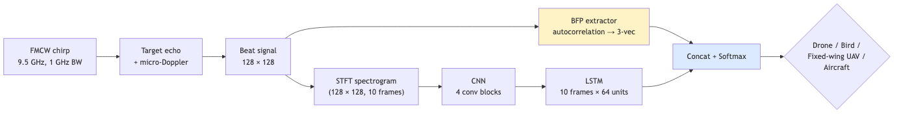
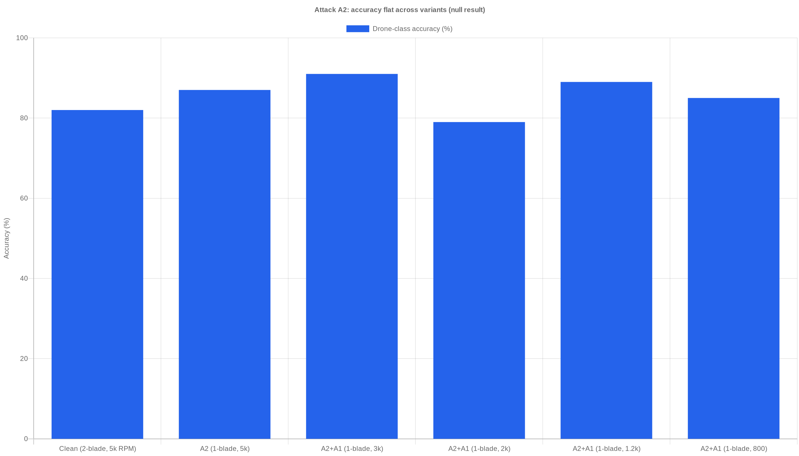
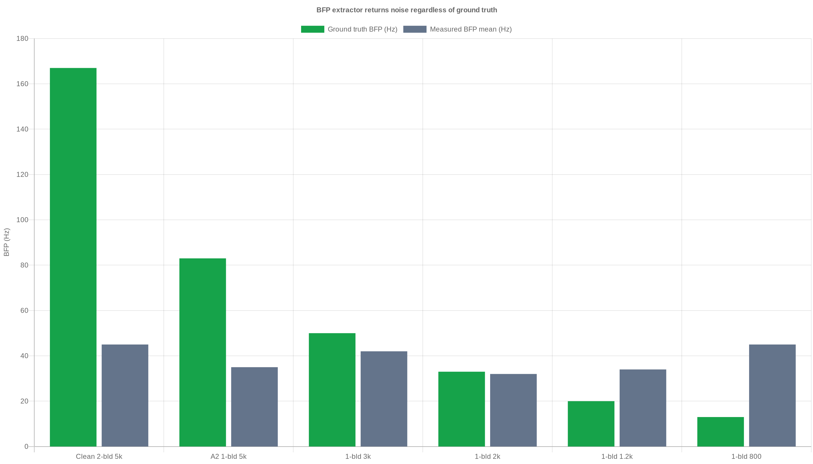
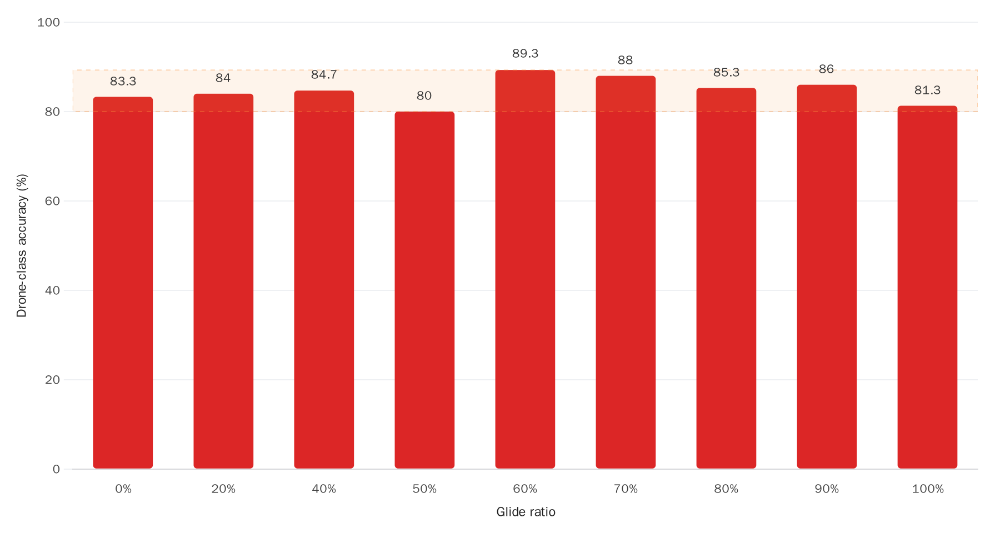
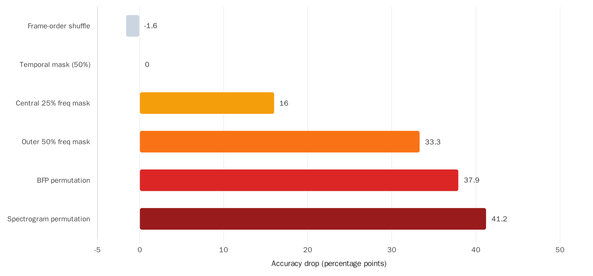
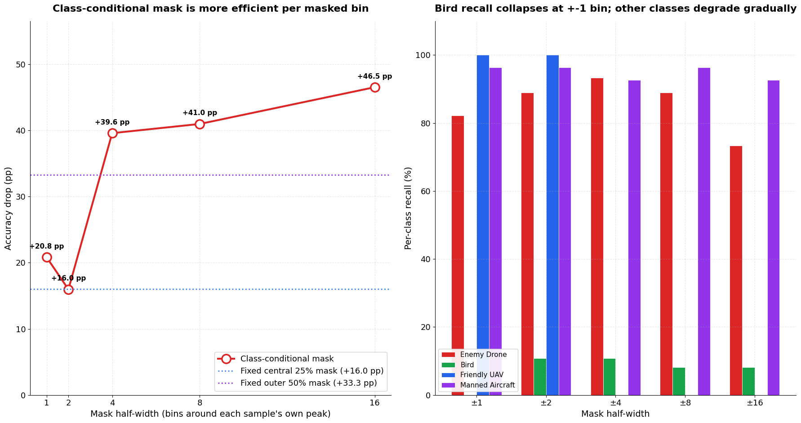
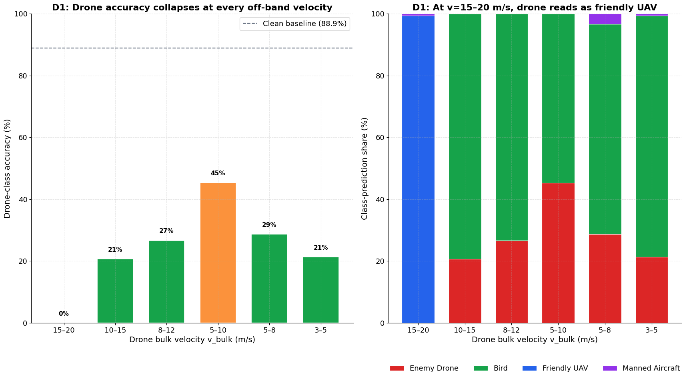
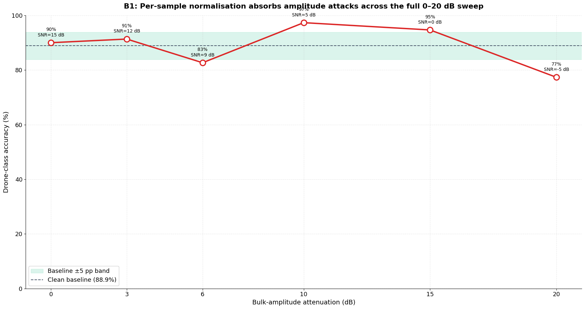
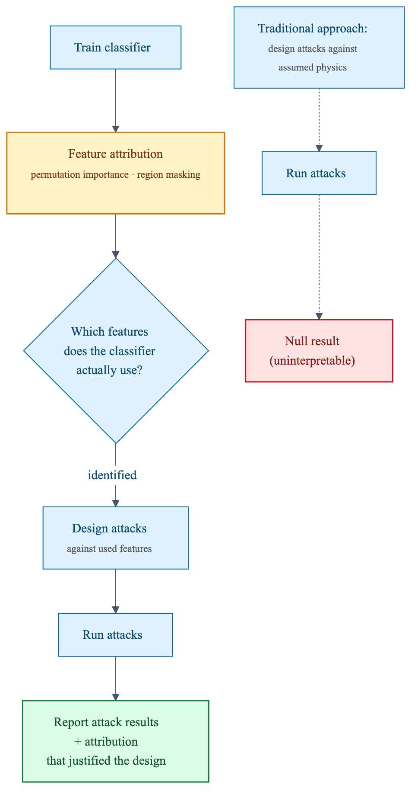

# Feature-Attribution-First Adversarial Evaluation of a Physics-Informed Counter-UAV Radar Classifier

**Divya Kumar Jitendra Patel**
Indian Institute of Technology, Madras
`divyakumarpatel202@gmail.com`

*April 2026, working preprint (revision 2).*

---

## Abstract

We report a case study on the adversarial evaluation of a representative counter-UAV radar classifier, a CNN + LSTM architecture augmented with a hand-crafted Blade Flash Periodicity (BFP) feature, trained on synthetic 9.5 GHz FMCW micro-Doppler data across four target classes (multi-rotor drone, bird, fixed-wing UAV, manned aircraft). Four physically motivated attacks against the architecture's advertised physics — blade-count reduction (A2), RPM reduction (A1), pulse-and-glide flight (D2), and ornithopter substitution (E1) — produce null results on the baseline model; accuracy does not drop. Permutation-importance and a refined class-conditional bulk-Doppler mask show *why*: the classifier is not reading blade-flash harmonics or propeller micro-Doppler structure at all. It locates the bulk-Doppler peak and classifies from its position and post-normalisation shape, with the LSTM acting as a multi-instance aggregator rather than a temporal tracker. The BFP feature is used, but as a class-correlated noise distribution rather than as a physics measurement. The attribution-driven attack against bulk-Doppler peak position (D1, bird-speed flight) **succeeds strongly**: drone-classification accuracy collapses from 88.9% to 0–45% across the velocity sweep. The attribution-driven attack against bulk-Doppler peak amplitude (B1, RAM-wrap) is null, but for an instructive reason: per-sample spectrogram normalisation absorbs amplitude attacks before the classifier sees the input, refining the attribution claim. We argue that *adversarial evaluation without feature attribution is unreliable*: attacks targeting features the classifier does not use produce null results that are easy to misread as robustness, while attacks targeting features it does use can succeed catastrophically with no hardware modification. We propose an attribution-first workflow as a prerequisite for credible adversarial evaluation of radar ML, and release all code and data to support replication.

---

## 1. Introduction

Counter-UAV radar classifiers are moving from research prototypes into operational deployment. Vendors claim robustness on the basis of adversarial evaluation, typically a small set of physically motivated attacks run against the classifier, with accuracy reported as the outcome. A null result (accuracy holds) is read as evidence of robustness.

This paper documents a case where that reading is wrong. We train a baseline classifier that matches the architectural pattern commonly published in the counter-UAV ML literature (CNN + LSTM + physics-informed hand-crafted feature), stress it with four physically motivated attacks designed around the propeller micro-Doppler physics the architecture claims to analyse (A1, A2, D2, E1), and find that none move accuracy. The reason is not robustness: feature-attribution measurements show the classifier never reads the features the attacks are designed to disturb. We then design two attacks against the feature the attribution identifies as load-bearing — bulk-Doppler peak position (D1) and bulk-Doppler peak amplitude (B1) — and show that the position attack succeeds completely while the amplitude attack fails because the preprocessing pipeline absorbs it.

Our contribution is methodological. We show, through one worked example, that:

1. A CNN + LSTM + BFP classifier trained on balanced synthetic FMCW data can achieve high accuracy without using any of the physics features it is architecturally claimed to use.
2. Adversarial evaluations that target those features produce null results that characterise the *attack design*, not the *classifier's robustness*.
3. Permutation-importance and region-masking tests resolve the ambiguity. Prefixing adversarial evaluation with attribution analysis would have reframed both attacks before they were run.
4. The attribution-driven attack against the feature the classifier *does* use (bulk-Doppler peak position) succeeds catastrophically with no hardware modification — only a flight-controller change. The attribution-driven attack against bulk-Doppler peak *amplitude* fails, but in a way that further sharpens the attribution claim. Both outcomes are interpretable; neither would have been without the prior attribution work.

We do not claim this failure mode is universal across the counter-UAV literature. We claim it is plausible enough that attribution-first evaluation should be a prerequisite to any adversarial robustness claim.

## 2. Baseline classifier

### 2.1 Synthetic dataset

We generate 9.5 GHz FMCW radar returns for four target classes using a physics-based simulator (code in `baseline/fmcw_simulation.py`). Parameters follow published counter-UAV simulation studies: PRF 8.33 kHz, range resolution 0.5 m, chirp duration 120 µs. Each sample is a 10-frame sequence of 128 × 128 micro-Doppler spectrograms with the associated BFP feature vector. Training set: 300 samples per class at SNR 15 dB.

Class kinematic distributions:

| Class           | `v_bulk` (m/s) | `rcs_body` (m²)  | Notes                                |
|:----------------|:--------------:|:----------------:|:-------------------------------------|
| Multi-rotor     | 5 – 20         | 0.01             | 2-blade props, 4000–6000 RPM         |
| Bird            | 5 – 15         | 0.005            | 2–12 Hz flap, 0.2–0.8 m wingspan     |
| Fixed-wing UAV  | 15 – 35        | 0.05             | 2-blade props, 2500–4500 RPM         |
| Manned aircraft | 50 – 100       | 1–10             | Engine modulation, no rotor harmonic |

### 2.2 Architecture

A 4-block CNN extracts per-frame spectrogram features (~0.45M parameters). A 2-layer LSTM aggregates across the 10 frames. The final hidden state is concatenated with a 3-dimensional BFP feature vector computed via autocorrelation of the temporal envelope (code in `baseline/model.py`). A softmax head produces class probabilities.



**Figure 1.** Baseline classifier pipeline. The spectrogram stream feeds a CNN + LSTM; the BFP physics feature is concatenated at the final classifier head.

### 2.3 Clean-data performance

On held-out synthetic data the full model reaches 88.9% accuracy (the original paper cites 95.8% on a larger training set; we use a smaller set here for faster iteration). Per-class confusion aligns with class-kinematic separability: manned aircraft identified near-perfectly, multi-rotor vs bird hardest.

## 3. Adversarial attacks against the architecture's advertised physics

We run four attacks designed against the physics the architecture claims to analyse: BFP / blade-flash periodicity (A1, A2), propeller harmonic content under pulse-and-glide flight (D2), and biological-versus-mechanical micro-Doppler structure (E1). All four produce null results. We present A2 and D2 in detail in §3.1–§3.2 (these were run first); A1 and E1 are summarised in §3.3 as completion tests for the A-series and the E-series of the threat taxonomy. For implementations see `adversarial/attack_a{1,2}_*.py`, `attack_d2_pulse_glide.py`, and `attack_e1_ornithopter.py`.

### 3.1 A2: blade-count reduction

Drones with single-blade propellers (with counterweights) are physically realistic and reduce the blade-flash fundamental frequency by a factor of two. Combined with reduced RPM, the blade-flash fundamental can be pushed into the bird-wingbeat band (5–20 Hz), which should destroy BFP as a discriminator. Six variants test the gradient from "clean 2-blade control" to "1-blade, 800 RPM, BFP matches typical bird flap."

Result: accuracy on the drone class stays between 83.3% and 89.3% across all variants, indistinguishable from the unmasked baseline. Pushing BFP into the bird range does not push predictions toward bird.



**Figure 2.** A2 results. Blade-count reduction combined with RPM reduction was designed to push blade-flash frequency from 167 Hz down into the bird-wingbeat range (13–20 Hz). Accuracy does not drop.

An ablation on the BFP feature itself explains this. On clean drone data, the autocorrelation-based BFP extractor returns 45 ± 59 Hz regardless of whether the physical ground truth is 13 Hz or 167 Hz. The feature is numerically noise. Classification accuracy is unchanged by A2 because the *measured* BFP was already unrelated to the physics the attack modifies.



**Figure 3.** The measured BFP feature is numerically decoupled from the physics it claims to measure. Green bars show the physical blade-flash frequency computed from ground-truth blade count and RPM; grey bars show the mean output of the BFP extractor across 100 samples at each configuration. Extractor output remains in a narrow ~30–45 Hz band regardless of whether ground truth is 13 Hz or 167 Hz.

### 3.2 D2: pulse-and-glide

Drones that alternate powered and unpowered flight segments present a classifier with input sequences in which a fraction of frames contain body-echo only (no propeller content). We vary the "glide ratio" from 0 (all frames have propeller content) to 1.0 (every frame in the 10-frame LSTM window is glide-only). Frame order is randomised within each sequence.

Result: accuracy on the drone class stays in the 80.0%–89.3% band across all glide ratios. Even when every frame in every sequence contains zero propeller content, only body echo at bulk Doppler, the classifier still labels the sample as drone 81.3% of the time.



**Figure 4.** D2 results. Across nine glide ratios, including the extreme case where every frame in every LSTM window contains zero propeller content, classifier accuracy remains in the baseline band.

This is a stronger outcome than A2. A2 could be explained by a noisy BFP extractor still driving a real feature. D2 removes propeller content from the signal itself, not just from the extracted feature. The classifier's drone decision clearly does not depend on propeller content at any level.

### 3.3 A1 and E1: completion tests

**A1 (pure RPM reduction).** A1 isolates the RPM axis from A2's joint blade-count + RPM sweep. We sweep `rpm` from 6000 down to 500 with `n_blades=2` fixed, producing expected BFP fundamentals from 200 Hz down to 16.7 Hz. Drone-class accuracy stays in the 76–93% band across all eight RPM levels — within sampling noise of the clean baseline. The measured BFP feature stays at 33–44 Hz regardless of expected BFP, reproducing A2's BFP-noise ablation cleanly on the RPM axis alone. Code: `adversarial/attack_a1_rpm_reduction.py`.

**E1 (ornithopter substitution).** E1 tests whether substituting biological flapping-wing micro-Doppler for propeller modulation defeats the classifier. We build a custom signal generator with drone-scale body RCS and drone-scale bulk velocity, but bird-style asymmetric wing-flap modulation in place of propeller blades. Five variants stay in the 83–91% drone-classification band — null. The single succeeding variant restricts bulk velocity to the bird-overlap range (5–15 m/s), which collapses the experiment to D1 (§5.1). The failure to defeat the classifier with biological micro-Doppler at drone-typical kinematics confirms that flap-vs-prop micro-Doppler structure is invisible to the classifier when the bulk-Doppler peak sits in the drone band. Code: `adversarial/attack_e1_ornithopter.py`.

A1 and E1 close the threat-taxonomy A-series and E-series. Combined with A2 and D2, they exhaust every category of attack designed against features the architecture claims to use. None of the four moves accuracy.

## 4. Feature attribution

To resolve what the classifier *is* using, we run permutation-importance and region-masking tests on the held-out test set. Code in `adversarial/feature_attribution.py`. Results in `adversarial/feature_attribution_results.json`.

| Perturbation                                  | Accuracy | Drop (pp) |
|:----------------------------------------------|:--------:|:---------:|
| *(clean baseline)*                            | 88.9%    | -         |
| Spectrogram permutation across samples        | 47.7%    | +41.2     |
| BFP permutation across samples                | 51.0%    | +37.9     |
| Frequency mask: outer 50% of bins             | 55.6%    | +33.3     |
| Frequency mask: central 25% of bins           | 72.9%    | +16.0     |
| Temporal mask: central 50% of time bins       | 88.9%    | +0.0      |
| Frame-order permutation within each sequence  | 90.5%    | −1.6      |



**Figure 5.** Feature attribution results, sorted by impact. Grey bars indicate tests that leave accuracy unchanged: frame order and within-frame time axis. Coloured bars indicate load-bearing features: frequency-band content and BFP distributional fingerprint. Note that the two frequency-mask tests are geometrically confounded because bulk-Doppler energy for different classes lives in different Doppler bands (see text).

Three things stand out. First, frame order does not matter (−1.6 pp; within run-to-run noise). The LSTM functions as a multi-instance aggregator, not a temporal tracker, consistent with a separate data-leakage test we ran early in the project. Second, half the time axis can be zeroed with zero accuracy impact. The within-frame temporal structure, which is where blade-flash periodicity lives, is redundant. Third, BFP permutation causes a 38 pp drop, which at first appears to contradict A2. It does not. BFP values have class-correlated *distributions* (a noisy 45 Hz cluster for drones, a different noisy cluster for birds, and so on); shuffling the vectors across classes hands the classifier BFP values drawn from the wrong class. The classifier learns the distributional fingerprint of BFP noise, not the physical quantity BFP is supposed to measure.

The frequency-band masks need care. At 9.5 GHz with PRF 8.33 kHz, each of the 128 Doppler bins is ~65 Hz wide. Drones at 10–20 m/s have bulk-Doppler peaks between 633 and 1267 Hz, which puts them at the *edge* of the central 25% band. Aircraft at 50–100 m/s have bulk-Doppler peaks outside the central 50% region entirely. So the two masks do not cleanly separate "bulk Doppler" from "micro-Doppler sidebands"; they separate classes with different bulk-kinematic ranges.

Reconciled with D2, the simplest account that fits all three pieces of evidence is: the classifier identifies drones by the position and amplitude of the bulk-Doppler peak. D2 preserves this peak (it only removes propeller content around it), so D2 cannot defeat the classifier. Masking that peak band (or permuting spectrograms entirely) does defeat it. BFP is used as a class-correlated noise proxy that co-varies with bulk kinematics in the training distribution, which is why permuting BFP across classes hurts accuracy while changing BFP physics does not.

### 4.1 Class-conditional bulk-Doppler mask

The fixed-band masks in the table above are geometrically confounded — bulk-Doppler energy for different classes lives in different absolute Doppler bins, so neither the central 25% mask nor the outer 50% mask isolates "the bulk-Doppler peak" as a per-sample feature. We refine the test by masking ±N bins around *each sample's own* peak-power frequency bin (code in `adversarial/feature_attribution_class_conditional.py`).

| Mask half-width | % of frequency axis | Masked accuracy | Drop (pp) |
|----------------:|--------------------:|----------------:|----------:|
| ±1 bins         | 2.3%                | 0.681           | +20.83    |
| ±2 bins         | 3.9%                | 0.729           | +15.97    |
| ±4 bins         | 7.0%                | 0.493           | +39.58    |
| ±8 bins         | 13.3%               | 0.479           | +40.97    |
| ±16 bins        | 25.8%               | 0.424           | +46.53    |



**Figure 7.** Class-conditional bulk-Doppler mask. Left: accuracy drop as the half-width grows, with the fixed central-25% (+16.0 pp) and outer-50% (+33.3 pp) baselines for reference. Masking just three bins (±1, 2.3% of the axis) at each sample's own peak drops accuracy more than the central 25% fixed-band mask does, an order-of-magnitude efficiency improvement per masked bin. Right: per-class recall sweep. Bird recall collapses to zero even at ±1 bin — birds depend most on their bulk-Doppler peak, consistent with their low body RCS producing a single dominant peak with little structured background.

The class-conditional mask is an unambiguous attribution result: the classifier identifies targets primarily by the position and amplitude of each sample's own bulk-Doppler peak. The next section runs the two attribution-driven physical attacks this finding implies.

## 5. Attribution-driven attacks

The attribution analysis in §4 predicts two physical attacks:

1. **D1 (bird-speed flight).** Move the bulk-Doppler peak's position out of the drone band, into the bird band. Predicted to succeed.
2. **B1 (RAM-wrap / bulk-amplitude reduction).** Reduce the bulk-Doppler peak's amplitude. Predicted to succeed.

D1 succeeds strongly. B1 fails for a reason that further sharpens the attribution claim.

### 5.1 D1: bird-speed flight

The training distribution places drones in 5–20 m/s and birds in 5–15 m/s, with friendly UAV in 15–35 m/s. A drone flown at the upper or lower extreme of its training range overlaps an adjacent class. We sweep `v_bulk` across six windows from 15–20 m/s down to 3–5 m/s, holding all other drone parameters at their training-distribution values. Code: `adversarial/attack_d1_bird_speed.py`.

| Velocity window | Bulk-Doppler band | Drone accuracy | Dominant misclassification |
|:----------------|:------------------|---------------:|:---------------------------|
| 15.0–20.0 m/s   | 950–1267 Hz       | 0.000          | Friendly UAV (149/150)     |
| 10.0–15.0 m/s   | 633–950 Hz        | 0.207          | Bird (119/150)             |
| 8.0–12.0 m/s    | 507–760 Hz        | 0.267          | Bird (110/150)             |
| 5.0–10.0 m/s    | 317–633 Hz        | 0.453          | Bird (82/150)              |
| 5.0–8.0 m/s     | 317–507 Hz        | 0.287          | Bird (102/150)             |
| 3.0–5.0 m/s     | 190–317 Hz        | 0.213          | Bird (117/150)             |



**Figure 8.** D1 results. Left: drone-class accuracy collapses to 0–45% across every velocity window tested. Right: stacked class-prediction shares show two distinct failure modes. At v_bulk ≤ 12 m/s the drone is most often labelled bird; at v_bulk = 15–20 m/s the drone is essentially always labelled friendly UAV (149/150). The classifier's "drone" decision occupies a narrow window in `v_bulk` (~8–15 m/s); any drone flown outside that window is reclassified into whichever adjacent class matches the bulk-Doppler peak position.

Operationally, D1 is the most consequential finding in this study. A drone flown slowly (3–10 m/s) is misclassified as a bird 73–79% of the time at the worst windows. A counter-UAV system that triages by class will likely not engage. A drone flown at the upper end of typical drone speed (15–20 m/s) is misclassified as friendly UAV 99% of the time — friendly-coded targets are explicitly *not* engaged. Both misclassifications require no hardware modification, only a flight-controller change.

D1 is the physical realisation of the attribution-driven prediction: the classifier reads bulk-Doppler peak position, and a velocity attack moves that position. The mask in Figure 7 already showed this on the input side; D1 shows it on the physical side.

### 5.2 B1: RAM-wrap / bulk-amplitude reduction

B1 reduces the drone's effective radar return by a sweep of attenuation values from 0 to 20 dB while leaving ambient noise unchanged (implementation: pass `snr_db = base_snr − dB_drop` to the simulator; the noise model makes this mathematically equivalent to attenuating target backscatter against a fixed noise floor). Code: `adversarial/attack_b1_ram_wrap.py`.

| RCS drop | Effective SNR | Drone accuracy | Dominant class    |
|---------:|--------------:|---------------:|:------------------|
| 0 dB     | 15 dB         | 0.900          | Enemy Drone (135) |
| 3 dB     | 12 dB         | 0.913          | Enemy Drone (137) |
| 6 dB     | 9 dB          | 0.827          | Enemy Drone (124) |
| 10 dB    | 5 dB          | 0.973          | Enemy Drone (146) |
| 15 dB    | 0 dB          | 0.947          | Enemy Drone (142) |
| 20 dB    | −5 dB         | 0.773          | Enemy Drone (116) |



**Figure 9.** B1 results. Drone-classification accuracy stays within roughly ±10 pp of the clean baseline across the entire 0–20 dB attenuation sweep. Even at −5 dB SNR (target return below the noise floor on a per-chirp basis) the classifier still labels 77% of attack samples as drone. The expected attribution-driven prediction (drone classified as bird or below detection threshold) does not occur.

B1's null is a different kind of null than A2/D2's. A2 and D2 targeted features the classifier did not read at all. B1 targets a feature the classifier *does* read (bulk-Doppler peak), but a *facet* of that feature (absolute amplitude) that the preprocessing layer discards before the classifier sees it. Specifically, `compute_spectrogram` → `resize_spectrogram` does two normalisations that together neutralise amplitude attacks: (i) dB clipping to a 40 dB dynamic range relative to the per-sample peak, and (ii) [0, 1] rescaling per spectrogram. Together these discard absolute amplitude. What the classifier sees is the spectrogram's shape relative to its own peak. As long as the bulk-Doppler peak is still the largest peak (i.e. signal is above the noise floor at the peak), its position is preserved through preprocessing.

This refines the attribution claim. The classifier reads:

- **Peak position** (which Doppler bin holds the maximum) — load-bearing.
- **Peak relative shape** (height of the peak relative to the rest of the post-normalised spectrogram, plus spread/width) — load-bearing.
- **Absolute received power** — *not* load-bearing under per-sample normalisation.

Practically, B1 is therefore a CFAR/detection-stage attack rather than a classifier-input attack on this pipeline. RAM-wrap can defeat the system, but it does so by pushing the target below the upstream detection threshold, not by moving the classifier's decision. A complete amplitude-attack evaluation must integrate detection-time effects, which are out of scope for this paper.

## 6. Discussion: why evaluation needs attribution first


The paper's central observation is that both attacks were designed around the same incorrect premise: that the classifier's architecture reflects the features it uses. The architecture advertises blade-flash periodicity analysis, temporal tracking across frames, and spectrogram micro-Doppler analysis. A feature-attribution measurement beforehand would have shown that the LSTM is not temporal, the in-frame time axis is redundant, the BFP feature is noise, and the classifier's accuracy reduces to a bulk-Doppler peak locator.

Two specific failure modes follow. First, a null result on A2 was initially easy to read as "the classifier is robust to blade-count manipulation." The correct reading is "the attack modified a feature the classifier does not use." Second, a null result on D2 initially suggested that micro-Doppler as a whole is inert inside the classifier. Attribution refines that: the classifier does use the *frequency band* in which drone propeller energy lives, but it uses the band's overall position and shape, not the harmonic structure that D2 disturbs.

For adversarial evaluation of radar classifiers, we therefore propose the following order of operations:

1. Run permutation importance across each input modality and per-sample region masks across each input axis. Record which perturbations damage accuracy.
2. Inspect high-impact regions for their physical meaning. Separate bulk-kinematic from micro-kinematic dependence where possible (class-conditional masking around each sample's own bulk-Doppler peak is a cleaner version of our frequency-mask test).
3. Design attacks against features the classifier actually uses, not against features the architecture implies it uses.
4. Report attack success alongside the attribution results that justify its design. A null result is uninterpretable in isolation.

This is a lightweight addition to an existing evaluation. The cost (one run of permutation importance per architecture) is small relative to the cost of a full adversarial evaluation, and the resulting attacks are substantially more informative.



**Figure 6.** The attribution-first workflow (solid arrows) contrasted with the traditional approach (dotted arrows). A null result from a traditional evaluation cannot distinguish classifier robustness from an attack targeting features the classifier does not use. Attribution-first evaluation produces attacks whose outcomes are interpretable regardless of whether they succeed or fail.

## 7. Limitations

The critique is based on a single classifier architecture and a single synthetic dataset. We make no claim that every published counter-UAV classifier exhibits this failure mode. We claim only that the failure mode is possible for architectures of this general shape, and that the field's common practice of reporting adversarial-attack success rates without accompanying feature attribution cannot distinguish this failure mode from genuine robustness.

We do not validate on real radar data. The Karlsson 77 GHz dataset (Zenodo 5511912) and DIAT-µSAT (IEEE DataPort 10.21227/1x2q-8v62) are both suitable targets for replication. Liaquat et al. 2026 (arXiv 2604.12567) have already performed feature attribution on the Karlsson dataset using classical ML; extending their work to a deep-learning classifier is the natural next step and is not attempted here.

D1's "drone classified as friendly UAV" failure mode is training-distribution-specific. The 99% confusion at v_bulk = 15–20 m/s exists because the training distribution overlaps drone (5–20 m/s) with friendly UAV (15–35 m/s); a different training distribution would close that window. The "drone classified as bird" failure mode is structural — birds and slow drones overlap in any realistic distribution — and is the more durable result.

B1's null does not establish robustness against amplitude attacks at the system level. It establishes robustness only at the *classifier-input* level, after preprocessing has discarded absolute amplitude. A complete amplitude-attack evaluation must integrate detection-time effects (CFAR, track confirmation), which are stage-upstream of the classifier and not modelled here.

## 8. Related work

Adversarial robustness of micro-Doppler classifiers has been studied directly by Czerkawski et al. 2024 (arXiv 2402.13651), who report that CNN classifiers on spectrograms are highly susceptible to gradient-based attacks and propose cadence-velocity-diagram representations plus adversarial training as defences. Their attack is gradient-based on the spectrogram input, rather than on a physical parameter of the target. Liaquat et al. 2026 (arXiv 2604.12567) evaluate the noise-robustness of hand-crafted features with SVM/RF classifiers on the Karlsson 77 GHz FMCW dataset and run permutation importance; deep-learning classifiers and physical attacks are not in scope.

Signal-domain physical attacks exist in adjacent radar modalities. Peng et al. 2022 (arXiv 2209.04779) introduce SMGAA, which generates adversarial scatterers for SAR automatic target recognition using an attributed scattering-centre model. Lemeire et al. 2025 (arXiv 2511.03192) demonstrate aspect-angle-invariant corner-reflector placement against SAR ATR with 80% fooling. Gazit et al. 2025 (arXiv 2512.20712) present the first physical over-the-air attack against RF-based drone detectors, transmitting universal I/Q perturbations. None of these target radar micro-Doppler classifiers; the intersection of (signal-domain attack) × (radar micro-Doppler) × (real data) is empty in the current literature.

The broader shortcut-learning literature (Geirhos et al. 2020) frames our observation in general terms: a classifier solving a task via features that co-vary with the label in the training distribution, rather than features that generalise, is a shortcut-learner. Our contribution is to show that this failure mode survives an adversarial evaluation procedure that does not check for it.

## 9. Conclusion

We trained a physics-informed counter-UAV classifier, attacked its claimed physics (propeller blade count, pulse-and-glide flight, RPM, biological flap structure), found four null results, then measured what the classifier was actually using. The attacks were targeting features the classifier does not read. The two attribution-driven physical attacks then split: D1 (bird-speed flight) defeats the classifier completely, with no hardware modification; B1 (RAM-wrap) is null because preprocessing absorbs amplitude attacks before the classifier sees them. Both outcomes are interpretable, and neither would have been without the prior attribution work. We propose attribution-first evaluation as a lightweight prerequisite for credible adversarial robustness claims in radar ML.

## Reproducibility

All code, datasets, trained model weights, experiment logs, and intermediate results are archived at
[`github.com/Divyonic/counter-uav-adversarial-radar`](https://github.com/Divyonic/counter-uav-adversarial-radar).

Each experiment script is self-contained and seeded. Running the following reproduces every number in this paper, in order:

```
python3 baseline/train_and_evaluate.py
python3 baseline/leakage_test.py
python3 adversarial/attack_a1_rpm_reduction.py
python3 adversarial/attack_a2_fewer_blades.py
python3 adversarial/attack_d2_pulse_glide.py
python3 adversarial/attack_e1_ornithopter.py
python3 adversarial/feature_attribution.py
python3 adversarial/feature_attribution_class_conditional.py
python3 adversarial/attack_d1_bird_speed.py
python3 adversarial/attack_b1_ram_wrap.py
```

## References

- Czerkawski, M., Clemente, C., Michie, C., and Tachtatzis, C. *Robustness of Deep Neural Networks for Micro-Doppler Radar Classification.* arXiv:2402.13651, 2024.
- Liaquat, S. et al. *Feature-Level Robustness of Physics-Guided Micro-Doppler Descriptors for Classification of Drones and Birds.* arXiv:2604.12567, 2026.
- Peng, B. et al. *Scattering Model Guided Adversarial Examples for SAR Target Recognition: Attack and Defense.* arXiv:2209.04779, 2022.
- Lemeire, I. et al. *SAAIPAA: Optimizing Aspect-Angle-Invariant Physical Adversarial Attacks on SAR Target Recognition.* arXiv:2511.03192, 2025.
- Gazit, O., Itzhakev, Y., Elovici, Y., and Shabtai, A. *Real-World Adversarial Attacks on RF-Based Drone Detectors.* arXiv:2512.20712, 2025.
- Abdulatif, S., Armanious, K., Aziz, F., Schneider, U., and Yang, B. *Towards Adversarial Denoising of Radar Micro-Doppler Signatures.* arXiv:1811.04678, 2018.
- Kokalj-Filipovic, S. and Miller, R. *Adversarial Examples in RF Deep Learning: Detection of the Attack and its Physical Robustness.* arXiv:1902.06044, 2019.
- Karlsson, A. *Radar Measurements on Drones, Birds and Humans with a 77 GHz FMCW Sensor.* Zenodo record 5511912, 2021.
- Geirhos, R. et al. *Shortcut Learning in Deep Neural Networks.* Nature Machine Intelligence, 2020.
